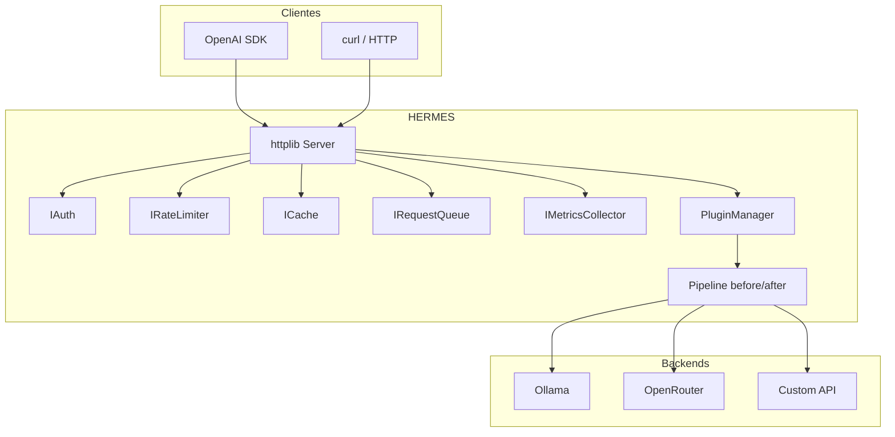
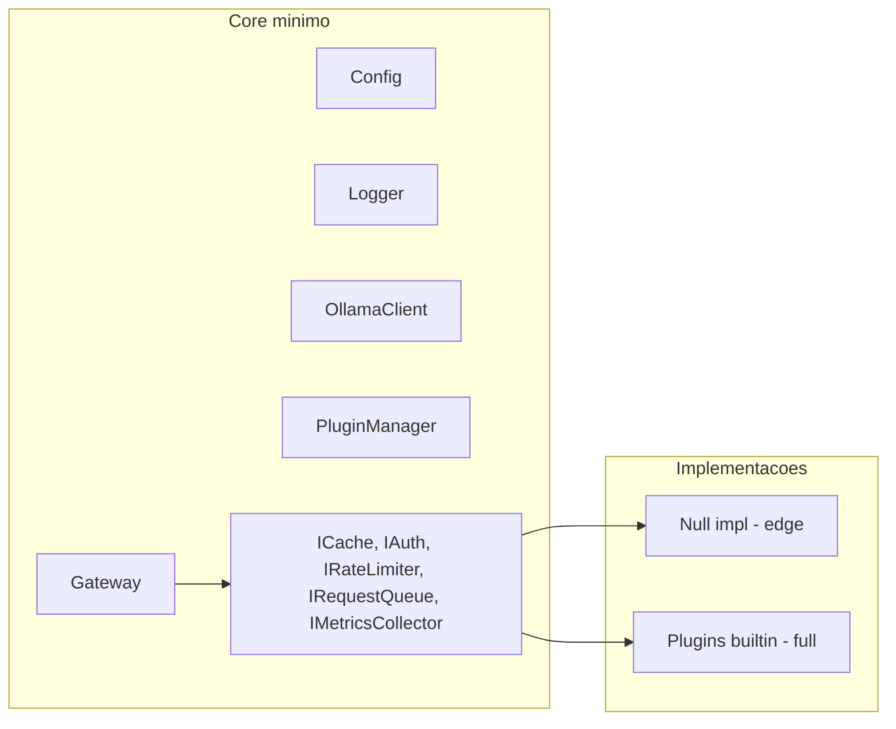
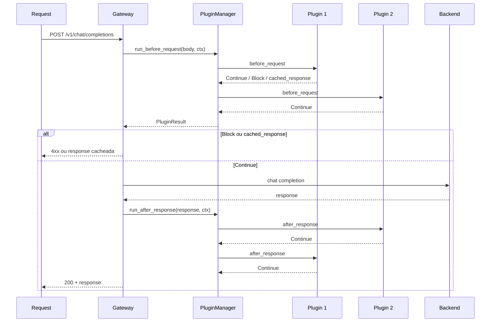
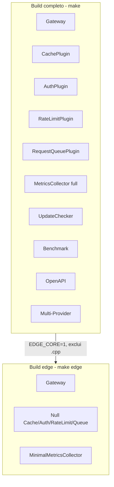

# Arquitetura do HERMES

Visao geral do sistema, componentes e fluxos. Especificacoes detalhadas em [spec/](spec/).

---

## Visao de alto nivel

---

## Core vs servicos plugaveis

| Componente | Build full | Build edge |
|------------|------------|------------|
| Cache | CachePlugin (ResponseCache) | NullCache |
| Auth | AuthPlugin (ApiKeyManager) | NullAuth |
| Rate limit | RateLimitPlugin | NullRateLimiter |
| Request queue | RequestQueuePlugin | NullRequestQueue |
| Metricas | MetricsCollector (full + Prometheus) | MinimalMetricsCollector |
| Update check | UpdateChecker | Desabilitado |

---

## Pipeline de plugins

Ordem: `before_request` na ordem do pipeline; `after_response` na ordem inversa.

Apos `run_after_response`, o gateway chama `PluginManager::notify_request_completed(entry)` com um `AuditEntry`. Plugins que implementam `IAuditSink` (ex.: plugin `audit`) recebem o evento de forma thread-safe e nao bloqueante (implementacoes usam fila + worker).

---

## Detection & Response e Compliance

- **Core:** Emite o evento "request completed" (`AuditEntry`) apos cada request via `notify_request_completed`. Nao persiste nem expõe endpoints de auditoria.
- **Plugin audit:** Implementa `IAuditSink` e `IAuditQueryProvider`; persiste em JSONL (e futuramente Syslog, HTTP, S3); expõe consulta via `GET /admin/audit`.
- **Plugins futuros:** Alerting e compliance reports podem consumir o mesmo evento (como sinks) ou ler dados do plugin audit. Ver [ADR-01-CORE-VS-PLUGIN.md](spec/ADR-01-CORE-VS-PLUGIN.md).

---

## Build edge vs build completo

Flags: `EDGE_CORE=1`, `BENCHMARK_ENABLED=0`, `DOCS_ENABLED=0`, `MULTI_PROVIDER=0`.

---

## Especificacoes por topico

| RF | Doc | Descricao |
|----|-----|-----------|
| RF-01 | [RF-01-FUNCIONAL.md](spec/RF-01-FUNCIONAL.md) | Roteamento multi-provider, fallback |
| RF-03 | [RF-03-FUNCIONAL.md](spec/RF-03-FUNCIONAL.md) | Fila de requests com prioridade |
| RF-04 | [RF-04-FUNCIONAL.md](spec/RF-04-FUNCIONAL.md) | Audit log (core + plugin) |
| RF-07 | [RF-07-FUNCIONAL.md](spec/RF-07-FUNCIONAL.md) | Cache por similaridade semantica |
| RF-10 | [RF-10-FUNCIONAL.md](spec/RF-10-FUNCIONAL.md) | Sistema de plugins (pipeline) |
| RF-13 | [RF-13-FUNCIONAL.md](spec/RF-13-FUNCIONAL.md) | Mascaramento de PII |
| RF-15 | [RF-15-FUNCIONAL.md](spec/RF-15-FUNCIONAL.md) | Deteccao de prompt injection |
| RF-27 | [RF-27-FUNCIONAL.md](spec/RF-27-FUNCIONAL.md) | Alerting (webhook, regras 4xx/blocked) |
| RF-28 | [RF-28-FUNCIONAL.md](spec/RF-28-FUNCIONAL.md) | Relatorio de postura ASPM |
| RF-29 | [RF-29-FUNCIONAL.md](spec/RF-29-FUNCIONAL.md) | Relatorios de compliance |
| RF-30 | [RF-30-FUNCIONAL.md](spec/RF-30-FUNCIONAL.md) | Testes de seguranca proativos |
| ADR-01 | [ADR-01-CORE-VS-PLUGIN.md](spec/ADR-01-CORE-VS-PLUGIN.md) | Core vs plugin (AllTrue TRiSM) |

Todas as especificacoes em [spec/](spec/).
