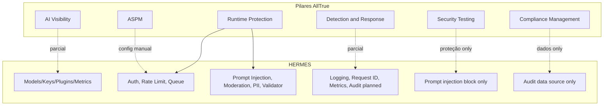

# Comparação: HERMES vs AllTrue.ai (Varonis)

Referência AllTrue: [Varonis + AllTrue](https://learn.varonis.com/alltrue/).

---

## Resumo executivo

| Aspecto    | HERMES                                                      | AllTrue.ai                                                                           |
| ---------- | ----------------------------------------------------------- | ------------------------------------------------------------------------------------ |
| **Tipo**   | Gateway/proxy HTTP (um ponto de entrada para LLMs)          | Plataforma enterprise de AI TRiSM (visibilidade, segurança, governança, compliance)  |
| **Escopo** | Tráfego que passa pelo gateway (Ollama, multi-provider)     | Todo o ambiente: ativos de IA, pipelines, identidades, dados                         |
| **Foco**   | Roteamento, performance, segurança em tempo real no request | Visibilidade corporativa, postura de segurança, auditoria e conformidade regulatória |

O HERMES cobre **parte** do que a AllTrue oferece em "runtime" e "proteção", mas não se propõe a ser um substituto de plataforma TRiSM; é um componente de infraestrutura que pode ser usado *dentro* de um ecossistema maior (onde ferramentas como AllTrue fariam descoberta, governança e compliance).

---

## Comparação por pilares AllTrue

### 1. AI Visibility (visibilidade de ativos de IA)

**AllTrue:** Descobrir continuamente ativos de IA, projetos e sistemas (incl. shadow AI) em todo o ambiente.

**HERMES:**

- **O que cobre:** Visibilidade **somente** do que passa pelo gateway:
  - [GET /v1/models](../README.md#endpoints) — modelos expostos (e aliases)
  - [GET /admin/keys](../README.md#gerenciamento-de-api-keys) — API keys e limites
  - [GET /admin/plugins](../README.md#endpoints) — plugins carregados
  - Métricas: [/metrics](../README.md#metricas), [/metrics/prometheus](../README.md#metricas) (requests, cache, uso)
- **Lacuna:** Não descobre nem cataloga ativos de IA fora do gateway (outros gateways, apps que chamam LLMs direto, shadow AI). É um único ponto de entrada configurado, não um "scanner" de ambiente.

**Conclusão:** Visibilidade limitada ao próprio gateway; sem discovery de shadow AI ou inventário corporativo.

---

### 2. AI Security Posture Management (ASPM)

**AllTrue:** Escanear agentes, chatbots e modelos em busca de vulnerabilidades e misconfigurações.

**HERMES:**

- **O que cobre:**
  - Configuração centralizada ([config.json](../config.json), env): backends, cache, rate limit, aliases, plugins
  - Admin restrito por `ADMIN_KEY` e `ADMIN_IP_WHITELIST`
  - Plugins de segurança configuráveis (prompt injection, content moderation, PII, response validator)
- **Lacuna:** Não há "scan" automatizado de postura (ex.: relatório de misconfig, vulnerabilidades em modelos/agentes). Não há inventário de "agentes" ou "chatbots" como entidades escaneáveis.

**Conclusão:** Configuração e hardening manuais; sem ASPM automatizado.

---

### 3. AI Runtime Protection (proteção em tempo de execução)

**AllTrue:** Políticas em tempo real para evitar vazamento de dados sensíveis e bloquear uso malicioso ou não conforme.

**HERMES — alinhado:**

- **Auth e acesso:** API keys (hash SHA-256), IP whitelist por key e admin, payload max ([README](../README.md) "Segurança").
- **Rate limiting:** Global e por key; headers estilo OpenAI; 429 + `Retry-After`.
- **Plugins no pipeline (before/after request):**
  - **Prompt injection** ([spec](spec/RF-15-FUNCIONAL.md)): detectar e bloquear injecao (pattern, heuristica, opcionalmente classificador).
  - **Content moderation** ([spec](spec/RF-14-FUNCIONAL.md)): filtrar input/output (wordlists, regex, opcionalmente modelo).
  - **PII redaction:** mascarar PII em mensagens e restaurar na resposta.
  - **Response validator:** validar tamanho e regras da resposta.
- **Request queue** e controle de custo por key (cost_controller) como formas de controle de uso.

**Conclusão:** Boa sobreposição em "runtime": controle de acesso, rate limit, anti–prompt injection, moderação de conteúdo, PII e validação de resposta. Falta camada de "políticas" declarativas de dados (ex.: políticas de dados sensíveis estilo Varonis).

---

### 4. AI Detection & Response (detecção e resposta)

**AllTrue:** Detectar e monitorar todo uso de IA, armazenar eventos de auditoria e alertas em tempo real sobre comportamento suspeito ou arriscado.

**HERMES:**

- **O que cobre:**
  - **Logging:** plugin de log estruturado de requests/responses.
  - **Request tracking:** `X-Request-Id` (UUID v4), eco de `X-Client-Request-Id`, ID em logs.
  - **Métricas:** contadores de requests, cache, erros, etc. (JSON e Prometheus).
  - **Audit log:** implementado em [RF-04-FUNCIONAL.md](spec/RF-04-FUNCIONAL.md) (JSONL, rotacao, consulta admin por key/periodo/modelo).
- **Lacuna:** Não há "alertas" configuráveis (ex.: regras de risco, notificações). Não há dashboard de segurança nem correlação de eventos para "response" (ex.: bloquear key, escalar incidente).

**Conclusão:** Detecção básica (logs + métricas + request ID); auditoria consultável planejada; falta alerting e resposta automatizada.

---

### 5. AI Security Testing

**AllTrue:** Testes de segurança proativos (ex.: prompt injection, jailbreaks).

**HERMES:**

- **O que cobre:**
  - Plugin **prompt_injection** que bloqueia tentativas em tempo real (não é "teste", é proteção).
  - [Benchmark](../README.md#benchmark-sincrono-feature-11) (Feature 11): testes de latência/tokens/score por categorias (gerais, Python, Agent Coder) — foco em performance, não em segurança.
  - Stress test para carga.
- **Lacuna:** Não há "AI Security Testing" como produto: nenhum scan proativo de prompt injection/jailbreak nem relatório de vulnerabilidades de modelos/agentes.

**Conclusão:** Proteção em runtime contra prompt injection; sem suíte de testes de segurança de IA.

---

### 6. AI Compliance Management

**AllTrue:** Relatórios de auditoria prontos para validar conformidade com regulamentos e frameworks de IA.

**HERMES:**

- **O que cobre:**
  - Logs estruturados e (planejado) audit log com request_id, key, IP, modelo, tokens, latency, etc. — útil como **fonte de dados** para compliance.
  - Rastreamento de uso por key (planejado em [RF-02-FUNCIONAL.md](spec/RF-02-FUNCIONAL.md)); cost_controller ja existe.
- **Lacuna:** Não há relatórios prontos para regulamentos (ex.: EU AI Act, frameworks específicos), nem mapeamento controle ↔ requisito de compliance.

**Conclusão:** Dados que podem alimentar compliance; sem camada de "AI Compliance Management" pronta para uso.

---

## Diagrama de sobreposição (conceitual)

---

## Tabela resumo: features do HERMES vs capacidades AllTrue

| Capacidade AllTrue                    | No HERMES     | Observação                                 |
| ------------------------------------- | -------------- | ------------------------------------------ |
| Descobrir ativos de IA / shadow AI    | Não            | Só o que passa pelo gateway; sem discovery |
| ASPM (scan de vulns/misconfig)        | Não            | Apenas config e hardening manual           |
| Controle de acesso (keys, IP)         | Sim            | Auth plugin, admin whitelist               |
| Rate limiting                         | Sim            | Global e por key                           |
| Bloquear prompt injection             | Sim            | Plugin prompt_injection                    |
| Moderação de conteúdo                 | Sim            | Plugin content_moderation                  |
| Proteção de PII                       | Sim            | Plugin pii_redactor                        |
| Validação de resposta                 | Sim            | Plugin response_validator                  |
| Auditoria (eventos por request)       | Planejado      | Spec Audit Log; logging já existe          |
| Alertas em tempo real                 | Não            | Apenas métricas e logs                     |
| Testes de segurança (jailbreak, etc.) | Não            | Só proteção em runtime                     |
| Relatórios de compliance prontos      | Não            | Dados para exportação/relatórios externos  |
| Multi-backend / multi-provider        | Sim            | Ollama + roadmap multi-provider            |
| Cache (LRU + semântico)               | Sim            | Cache + semantic_cache plugin              |
| Métricas (Prometheus/JSON)            | Sim            | /metrics, /metrics/prometheus              |

---

## Conclusões

- **Onde o HERMES se alinha bem com AllTrue:** Runtime protection (auth, rate limit, prompt injection, content moderation, PII, response validation) e, em parte, detection (logs, request ID, métricas; audit planejado).
- **Onde o HERMES não substitui AllTrue:** Visibility (shadow AI, inventário corporativo), ASPM, AI Security Testing como produto, Compliance Management prontos para uso e alerting/response automatizados.
- **Papel sugerido:** O HERMES funciona como **gateway seguro e observável** na borda do tráfego LLM (ex.: para Ollama e outros backends). Em um cenário enterprise, uma solução como AllTrue poderia usar o gateway como uma **fonte de tráfego e eventos** e adicionar descoberta, governança, testes de segurança e compliance em cima.

Se quiser, posso detalhar um plano de evolução do HERMES para aproximar mais de algum pilar específico (por exemplo: audit + alerting, ou um módulo mínimo de "security testing").

---

## Planejamento de implementação (Core vs Plugin)

A definicao do que fica no **core** e do que vira **plugin** para cada capacidade AllTrue esta em [ADR-01-CORE-VS-PLUGIN.md](spec/ADR-01-CORE-VS-PLUGIN.md).
