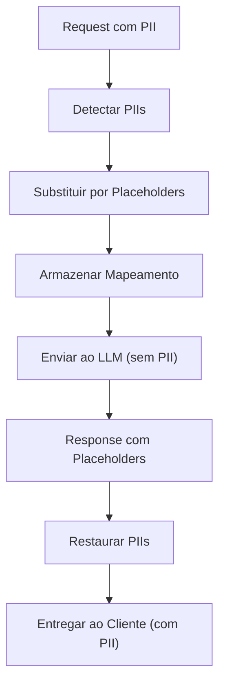

# RF-13 — PII Redaction

- **RF:** RF-13
- **Titulo:** PII Redaction
- **Autor:** HERMES Team
- **Data:** 2026-03-09
- **Versao:** 1.0
- **Status:** IMPLEMENTADO

## Objetivo

Plugin que intercepta requests e responses para detectar e mascarar dados pessoais identificaveis (PII) antes que cheguem ao modelo LLM. Na response, os placeholders sao re-substituidos pelos valores originais. Garante que dados sensiveis nunca saiam da rede interna quando o backend e um provider cloud.

## Escopo

- **Inclui:** Deteccao e redacao de PII em before_request; restauracao em after_response; patterns builtin (CPF, email, phone, credit_card, CNPJ); custom patterns via regex; mapeamento placeholder->valor no RequestContext; log de redacoes; configuracao via config.json
- **Nao inclui:** NER (Named Entity Recognition) para nomes proprios; persistencia do mapeamento em disco; validacao de digitos verificadores do CPF; suporte completo a streaming com buffering

## Descricao Funcional Detalhada

### Arquitetura



### Fluxo Detalhado

1. **before_request**: Escaneia todas as mensagens no body. Substitui PIIs por placeholders (`[NOME_1]`, `[CPF_1]`). Armazena mapeamento no `RequestContext.metadata`.
2. **after_response**: Busca placeholders na response e re-substitui pelos valores originais.

## Interface / Contrato

```cpp
struct PIIPattern {
    std::string name;       // "cpf", "email", "phone", "name"
    std::regex pattern;
    std::string placeholder_prefix;  // "[CPF_", "[EMAIL_"
};

class PIIRedactorPlugin : public Plugin {
public:
    std::string name() const override { return "pii_redactor"; }
    std::string version() const override { return "1.0.0"; }

    bool init(const Json::Value& config) override;

    PluginResult before_request(Json::Value& body,
                                 RequestContext& ctx) override;

    PluginResult after_response(Json::Value& response,
                                 RequestContext& ctx) override;

private:
    std::vector<PIIPattern> patterns_;
    bool log_redactions_ = true;
    bool block_on_detection_ = false;

    struct RedactionMap {
        std::unordered_map<std::string, std::string> placeholder_to_value;
    };

    std::string redact_text(const std::string& text,
                             RedactionMap& map);
    std::string restore_text(const std::string& text,
                              const RedactionMap& map) const;
    void redact_messages(Json::Value& messages,
                          RedactionMap& map);
};
```

### Patterns Builtin

| Pattern | Regex | Exemplo |
|---|---|---|
| `cpf` | `\b\d{3}\.\d{3}\.\d{3}-\d{2}\b` | 123.456.789-00 |
| `email` | `\b[A-Za-z0-9._%+-]+@[A-Za-z0-9.-]+\.[A-Z\|a-z]{2,}\b` | joao@email.com |
| `phone` | `\b\(?\d{2}\)?[\s-]?\d{4,5}-?\d{4}\b` | (11) 99999-1234 |
| `credit_card` | `\b\d{4}[\s-]?\d{4}[\s-]?\d{4}[\s-]?\d{4}\b` | 4111-1111-1111-1111 |
| `cnpj` | `\b\d{2}\.\d{3}\.\d{3}/\d{4}-\d{2}\b` | 12.345.678/0001-00 |

## Configuracao

```json
{
  "plugins": {
    "pipeline": [
      {
        "name": "pii_redactor",
        "enabled": true,
        "config": {
          "patterns": ["cpf", "email", "phone", "credit_card"],
          "custom_patterns": [
            {
              "name": "internal_id",
              "regex": "ID-\\d{8}",
              "placeholder": "INTERNAL_ID"
            }
          ],
          "log_redactions": true,
          "block_on_detection": false,
          "restore_in_response": true
        }
      }
    ]
  }
}
```

## Endpoints

N/A — plugin de pipeline, sem endpoints proprios.

## Regras de Negocio

1. PIIs detectados sao substituidos por placeholders unicos (`[CPF_1]`, `[EMAIL_1]`, etc.).
2. O mapeamento placeholder->valor e armazenado no RequestContext e descartado apos a response.
3. Na response, placeholders sao restaurados pelos valores originais antes de entregar ao cliente.
4. Custom patterns permitem regex e placeholder customizado.
5. `block_on_detection: true` bloqueia o request ao detectar PII (comportamento opcional).

## Dependencias e Integracoes

- **Internas**: Feature 10 (Plugin System), `<regex>` do C++23
- **Externas**: Nenhuma

## Criterios de Aceitacao

- [ ] CPF, email, phone, credit_card e CNPJ sao detectados e redactados no before_request
- [ ] Placeholders sao restaurados no after_response
- [ ] Custom patterns funcionam conforme configuracao
- [ ] Mapeamento nao persiste apos a response
- [ ] Log de redacoes quando habilitado

## Riscos e Trade-offs

1. **Regex performance**: Muitos patterns aplicados em textos longos podem impactar latencia. Compilar regex uma vez e reutilizar.
2. **Falsos positivos**: Numeros que parecem CPF mas nao sao (ex: codigos internos). Validar digitos verificadores do CPF pode reduzir falsos positivos.
3. **Nomes proprios**: Detectar nomes e muito dificil com regex. Requer NER para alta precisao.
4. **Contexto perdido**: O LLM recebe `[NOME_1]` em vez do nome real. Em alguns casos o placeholder perde informacao relevante.
5. **Streaming**: Em streaming, os placeholders podem ser divididos entre chunks. Precisa de buffering para detectar placeholders completos no after_response.
6. **Mapeamento por request**: O mapeamento e armazenado no RequestContext e descartado apos a response. Nao persiste em disco.

## Status de Implementacao

IMPLEMENTADO — Plugin PII Redaction funcional com patterns builtin, redacao em before_request e restauracao em after_response.

## Checklist de Qualidade

- [ ] Objetivo claro e testavel
- [ ] Escopo dentro/fora definido
- [ ] Regras de negocio sem ambiguidade
- [ ] Criterios de aceitacao verificaveis
- [ ] Excecoes e limites cobertos
