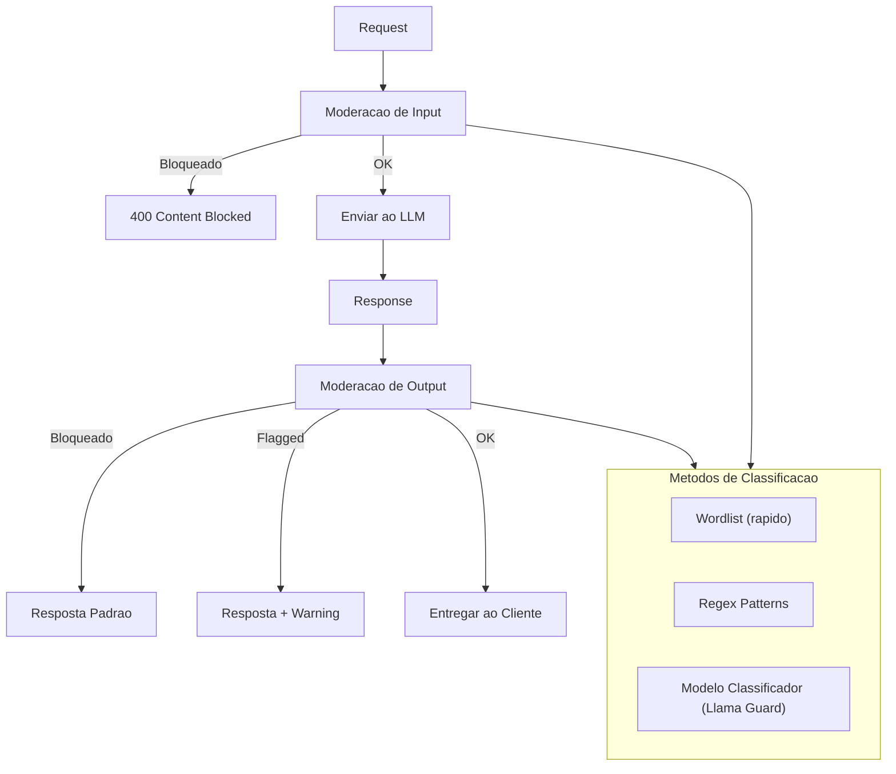

# RF-14 — Content Moderation

- **RF:** RF-14
- **Titulo:** Content Moderation
- **Autor:** HERMES Team
- **Data:** 2026-03-09
- **Versao:** 1.0
- **Status:** IMPLEMENTADO

## Objetivo

Plugin que filtra conteudo improprio tanto no input (prompt do usuario) quanto no output (resposta do LLM). Utiliza combinacao de wordlists, regex patterns e opcionalmente um modelo classificador (ex: Llama Guard) para detectar e bloquear conteudo que viola politicas configuradas.

## Escopo

- **Inclui:** Moderacao de input e output; block_words e block_patterns; categorias (hate, violence, sexual, self_harm, illegal, pii, custom); acoes block/warn/log; resposta padrao quando bloqueado; log de violacoes; endpoint de estatisticas
- **Nao inclui:** Modelo classificador ML obrigatorio (opcional); wordlists multilinguagem completas; moderacao em streaming com buffering completo

## Descricao Funcional Detalhada

### Arquitetura



### Categorias de Moderacao

| Categoria | Descricao |
|---|---|
| `hate` | Discurso de odio, discriminacao |
| `violence` | Violencia, ameacas |
| `sexual` | Conteudo sexual explicito |
| `self_harm` | Auto-mutilacao, suicidio |
| `illegal` | Atividades ilegais, drogas |
| `pii` | Dados pessoais (complementar ao Plugin 01) |
| `custom` | Categorias customizadas |

## Interface / Contrato

```cpp
struct ModerationResult {
    bool flagged;
    std::string category;
    float confidence;
    std::string action;  // "block", "warn", "log"
    std::string matched_rule;
};

struct ModerationPolicy {
    std::string category;
    std::string action;         // "block", "warn", "log"
    float threshold = 0.8f;     // para classificacao por modelo
};

class ContentModerationPlugin : public Plugin {
public:
    std::string name() const override { return "content_moderation"; }
    std::string version() const override { return "1.0.0"; }

    bool init(const Json::Value& config) override;

    PluginResult before_request(Json::Value& body,
                                 RequestContext& ctx) override;

    PluginResult after_response(Json::Value& response,
                                 RequestContext& ctx) override;

private:
    std::vector<ModerationPolicy> policies_;
    std::unordered_map<std::string, std::vector<std::string>> wordlists_;
    std::vector<RegexRule> regex_rules_;
    bool use_model_ = false;
    std::string moderation_model_;
    std::string blocked_response_;
    bool log_violations_ = true;
    bool moderate_output_ = true;

    [[nodiscard]] std::vector<ModerationResult> check_text(
        const std::string& text) const;
};
```

## Configuracao

```json
{
  "plugins": {
    "pipeline": [
      {
        "name": "content_moderation",
        "enabled": true,
        "config": {
          "policies": [
            {"category": "hate", "action": "block", "threshold": 0.8},
            {"category": "violence", "action": "block", "threshold": 0.8},
            {"category": "sexual", "action": "block", "threshold": 0.9},
            {"category": "illegal", "action": "warn", "threshold": 0.7}
          ],
          "wordlists": {
            "hate": ["slur1", "slur2"],
            "violence": ["kill", "murder", "weapon"]
          },
          "regex_rules": [
            {"category": "illegal", "pattern": "(?i)how to (make|build|create) (a )?(bomb|weapon|drug)"}
          ],
          "use_model": false,
          "moderation_model": "llama-guard",
          "blocked_response": "I'm sorry, but I can't assist with that request.",
          "moderate_output": true,
          "log_violations": true
        }
      }
    ]
  }
}
```

## Endpoints

| Metodo | Path | Descricao |
|---|---|---|
| `GET` | `/admin/moderation/stats` | Estatisticas de moderacao |

### Response

```json
{
  "total_checked": 15420,
  "total_blocked": 23,
  "total_warned": 45,
  "by_category": {
    "hate": {"blocked": 12, "warned": 5},
    "violence": {"blocked": 8, "warned": 15},
    "sexual": {"blocked": 3, "warned": 10},
    "illegal": {"blocked": 0, "warned": 15}
  }
}
```

## Regras de Negocio

1. Input bloqueado retorna HTTP 400 com `type: content_policy_violation`.
2. Output bloqueado retorna resposta padrao configurada em `blocked_response`.
3. Acao `warn` permite passar mas adiciona header `X-Content-Warning: category (confidence)`.
4. Wordlists e regex sao aplicados antes do modelo classificador (quando habilitado).
5. `moderate_output: false` desabilita moderacao na response.

## Dependencias e Integracoes

- **Internas**: Feature 10 (Plugin System), `OllamaClient` (se usar modelo classificador)
- **Externas**: Nenhuma obrigatoria
- **Opcional**: Modelo Llama Guard ou similar no Ollama para classificacao por ML

## Criterios de Aceitacao

- [ ] Input com conteudo bloqueado retorna 400
- [ ] Output bloqueado retorna resposta padrao
- [ ] Wordlists e regex funcionam conforme configuracao
- [ ] Acao warn adiciona header X-Content-Warning
- [ ] Endpoint /admin/moderation/stats retorna estatisticas corretas

## Riscos e Trade-offs

1. **Falsos positivos**: Wordlists e regex sao propensos a falsos positivos. "Kill" em "kill the process" seria bloqueado.
2. **Latencia do modelo**: Usar Llama Guard adiciona 100-500ms por request.
3. **Cobertura**: Wordlists nao cobrem variacoes criativas (leetspeak, unicode tricks).
4. **Multilinguagem**: Wordlists em ingles nao funcionam para portugues.
5. **Streaming**: Moderar output em streaming requer buffering de chunks.
6. **Over-moderation**: Muito bloqueio frustra usuarios legitimos.

## Status de Implementacao

IMPLEMENTADO — Plugin Content Moderation funcional com block_words, block_patterns e verificacao em input/output.

## Checklist de Qualidade

- [ ] Objetivo claro e testavel
- [ ] Escopo dentro/fora definido
- [ ] Regras de negocio sem ambiguidade
- [ ] Criterios de aceitacao verificaveis
- [ ] Excecoes e limites cobertos
