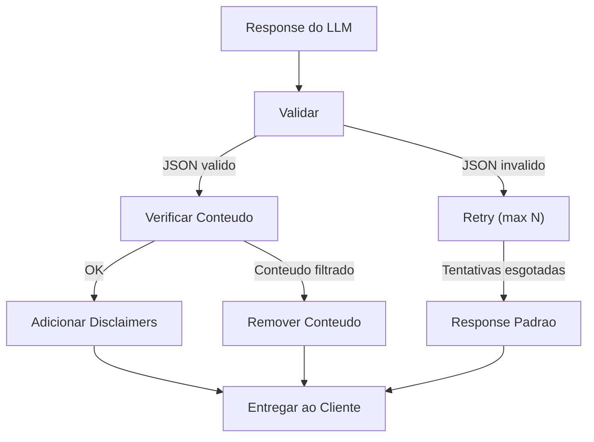

# RF-16 — Response Validator

- **RF:** RF-16
- **Titulo:** Response Validator
- **Autor:** HERMES Team
- **Data:** 2026-03-09
- **Versao:** 1.0
- **Status:** IMPLEMENTADO

## Objetivo

Plugin que valida a resposta do LLM antes de entrega-la ao cliente. Verifica se o JSON e valido quando `response_format=json_object`, faz retry automatico se a validacao falhar, filtra conteudo indesejado, e pode adicionar disclaimers obrigatorios. Garante qualidade consistente das respostas.

## Escopo

- **Inclui:** Validacao de JSON quando response_format=json_object; max_content_length; fallback_message quando validacao falha; regras de validacao (regex_block, regex_require, max_length); disclaimers condicionais por trigger; retry automatico em caso de JSON invalido
- **Nao inclui:** Validacao de JSON schema completa (apenas parseable); suporte completo a streaming; deteccao de disclaimers duplicados

## Descricao Funcional Detalhada

### Arquitetura



## Interface / Contrato

```cpp
struct ValidationRule {
    std::string name;
    enum Type { JsonValid, JsonSchema, RegexBlock, RegexRequire, MaxLength };
    Type type;
    std::string value;  // schema, regex ou limite
    std::string action; // "retry", "block", "redact", "warn"
};

class ResponseValidatorPlugin : public Plugin {
public:
    std::string name() const override { return "response_validator"; }
    std::string version() const override { return "1.0.0"; }

    bool init(const Json::Value& config) override;

    PluginResult before_request(Json::Value& body,
                                 RequestContext& ctx) override;

    PluginResult after_response(Json::Value& response,
                                 RequestContext& ctx) override;

private:
    std::vector<ValidationRule> rules_;
    int max_retries_ = 2;
    std::string fallback_message_;
    std::vector<std::string> disclaimers_;
    bool validate_json_mode_ = true;

    struct ValidationResult {
        bool valid;
        std::string failed_rule;
        std::string details;
    };

    [[nodiscard]] ValidationResult validate(
        const std::string& content,
        const RequestContext& ctx) const;

    void add_disclaimers(Json::Value& response) const;
};
```

## Configuracao

```json
{
  "plugins": {
    "pipeline": [
      {
        "name": "response_validator",
        "enabled": true,
        "config": {
          "validate_json_mode": true,
          "max_retries": 2,
          "fallback_message": "Sorry, I was unable to generate a valid response. Please try again.",
          "rules": [
            {
              "name": "no_urls",
              "type": "regex_block",
              "value": "https?://[^\\s]+",
              "action": "redact"
            },
            {
              "name": "max_length",
              "type": "max_length",
              "value": "10000",
              "action": "warn"
            }
          ],
          "disclaimers": [
            {
              "trigger": "(?i)(medical|health|diagnosis|treatment)",
              "text": "\n\n---\nDisclaimer: This is not professional medical advice. Consult a healthcare provider."
            }
          ]
        }
      }
    ]
  }
}
```

## Endpoints

N/A — plugin de pipeline, sem endpoints proprios.

## Regras de Negocio

1. Quando `response_format: json_object`, o plugin valida se o content e JSON parseable.
2. JSON invalido dispara retry (max N vezes). Se esgotar, retorna `fallback_message`.
3. Regras regex_block removem conteudo que matcha o pattern.
4. Regras max_length emitem warning quando excedido.
5. Disclaimers sao adicionados quando o content matcha o trigger regex.
6. Streaming: validacao pos-response nao funciona com streaming; desabilitar ou bufferar.

## Dependencias e Integracoes

- **Internas**: Feature 10 (Plugin System), `OllamaClient` (para retries)
- **Externas**: Nenhuma

## Criterios de Aceitacao

- [ ] JSON invalido em json_object mode dispara retry
- [ ] Max retries atingido retorna fallback_message
- [ ] Regras regex_block redactam conteudo
- [ ] max_content_length e respeitado
- [ ] Disclaimers sao adicionados quando trigger matcha
- [ ] validate_json_object declarado e utilizado no fluxo

## Riscos e Trade-offs

1. **Retry latencia**: Cada retry adiciona latencia de uma inferencia completa.
2. **Retry idempotencia**: Retries podem gerar respostas completamente diferentes.
3. **Streaming**: Validacao pos-response nao funciona com streaming.
4. **Falsos positivos**: Regex de bloqueio pode ser muito agressivo.
5. **Schema validation**: Validar JSON schema em C++ e trabalhoso. Limitar a JSON parseable.
6. **Disclaimers duplicados**: Se o LLM ja inclui disclaimer, o plugin pode duplicar.

## Status de Implementacao

IMPLEMENTADO — ResponseValidatorPlugin completado com: validacao JSON quando response_format=json_object, regras ValidationRule (regex_block, regex_require, max_length), redacao via regex, disclaimers condicionais por trigger regex, fallback_message.

### Limitacao conhecida: Retry automatico

O retry automatico para JSON invalido (re-enviar request ao LLM) nao esta implementado. A arquitetura atual de plugins opera apenas no pipeline request/response e nao permite re-invocar o backend LLM a partir de um plugin `after_response`. Quando JSON invalido e detectado, o conteudo e substituido pelo `fallback_message` imediatamente. Para implementar retry, seria necessario:
1. Adicionar `PluginAction::Retry` ao enum de acoes do plugin
2. O gateway interpretar essa acao e re-executar o backend call
3. Controlar `max_retries` no nivel do gateway

Este e um enhancement arquitetural planejado para uma versao futura.

## Checklist de Qualidade

- [ ] Objetivo claro e testavel
- [ ] Escopo dentro/fora definido
- [ ] Regras de negocio sem ambiguidade
- [ ] Criterios de aceitacao verificaveis
- [ ] Excecoes e limites cobertos
