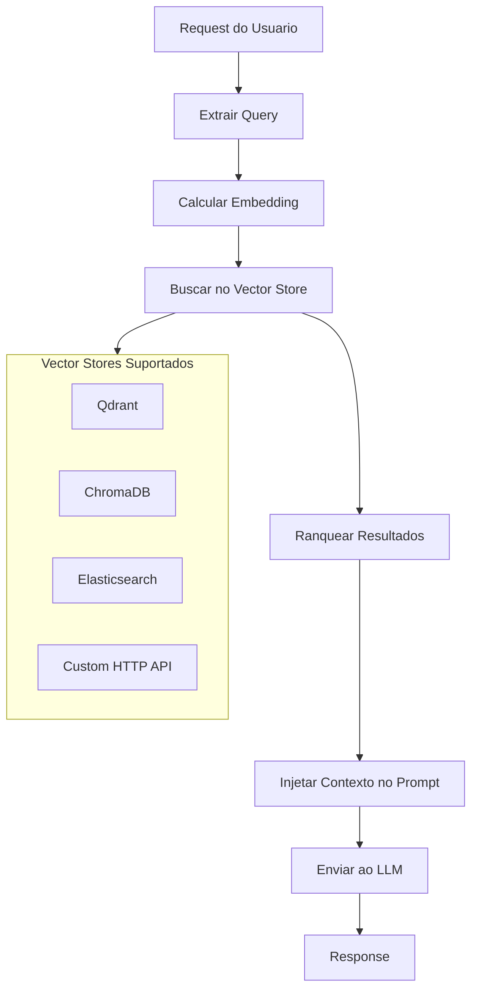

# RF-17 — RAG Injector

- **RF:** RF-17
- **Titulo:** RAG Injector
- **Autor:** HERMES Team
- **Data:** 2026-03-09
- **Versao:** 1.0
- **Status:** IMPLEMENTADO

## Objetivo

Plugin que automaticamente busca documentos relevantes de uma base de conhecimento externa e injeta como contexto no prompt antes de enviar ao modelo LLM. Transforma qualquer aplicacao que usa o gateway em um sistema RAG (Retrieval-Augmented Generation) sem modificar o cliente.

## Escopo

- **Inclui:** Injecao de rag_context no body; injecao no system message; configuracao de vector store (Qdrant, Chroma, Elasticsearch, HTTP); embedding_model; max_context_tokens; context_template; add_sources; excluded_models para evitar loop
- **Nao inclui:** Integracao completa com vector store (planejada); calculo de embedding real; busca em vector store real — atualmente aceita rag_context fornecido no body

## Descricao Funcional Detalhada

### Arquitetura



### Componentes

- **RAGInjectorPlugin**: Plugin principal que coordena o fluxo.
- **VectorStoreClient**: Interface para comunicacao com vector stores (planejado).
- **ContextBuilder**: Monta o system prompt com os documentos recuperados.

## Interface / Contrato

```cpp
struct RetrievedDocument {
    std::string content;
    float score;
    std::string source;     // nome do arquivo/URL de origem
    Json::Value metadata;
};

struct VectorStoreConfig {
    std::string type;       // "qdrant", "chroma", "elasticsearch", "http"
    std::string url;
    std::string collection;
    std::string api_key;
    int top_k = 5;
    float min_score = 0.7f;
};

class VectorStoreClient {
public:
    virtual ~VectorStoreClient() = default;

    [[nodiscard]] virtual std::vector<RetrievedDocument> search(
        const std::vector<float>& embedding,
        int top_k,
        float min_score) = 0;
};

class RAGInjectorPlugin : public Plugin {
public:
    std::string name() const override { return "rag_injector"; }
    std::string version() const override { return "1.0.0"; }

    bool init(const Json::Value& config) override;

    PluginResult before_request(Json::Value& body,
                                 RequestContext& ctx) override;

    PluginResult after_response(Json::Value& response,
                                 RequestContext& ctx) override;

private:
    VectorStoreConfig vs_config_;
    std::unique_ptr<VectorStoreClient> vs_client_;
    std::string embedding_model_;
    std::string context_template_;
    int max_context_tokens_ = 2000;
    bool add_sources_ = true;

    [[nodiscard]] std::vector<float> compute_embedding(const std::string& text);
    [[nodiscard]] std::string build_context(
        const std::vector<RetrievedDocument>& docs) const;
    void inject_context(Json::Value& messages,
                         const std::string& context) const;
};
```

## Configuracao

```json
{
  "plugins": {
    "pipeline": [
      {
        "name": "rag_injector",
        "enabled": true,
        "config": {
          "vector_store": {
            "type": "qdrant",
            "url": "http://localhost:6333",
            "collection": "knowledge_base",
            "top_k": 5,
            "min_score": 0.7
          },
          "embedding_model": "nomic-embed-text",
          "max_context_tokens": 2000,
          "context_template": "Use the following context to answer the user's question. If the context doesn't contain relevant information, say so.\n\nContext:\n{{documents}}",
          "add_sources": true,
          "excluded_models": ["text-embedding-3-small"]
        }
      }
    ]
  }
}
```

### Variaveis de Ambiente

| Variavel | Descricao | Default |
|---|---|---|
| `RAG_VECTOR_STORE_URL` | URL do vector store | (vazio) |
| `RAG_VECTOR_STORE_API_KEY` | API key do vector store | (vazio) |
| `RAG_EMBEDDING_MODEL` | Modelo para embeddings | `nomic-embed-text` |
| `RAG_TOP_K` | Numero de documentos a recuperar | `5` |
| `RAG_MIN_SCORE` | Score minimo de similaridade | `0.7` |

## Endpoints

N/A — plugin de pipeline. O cliente pode enviar `rag_context` no body para injecao manual.

## Regras de Negocio

1. Se `rag_context` estiver presente no body, o plugin injeta no system message.
2. Contexto e injetado antes da primeira mensagem do usuario (ou system existente).
3. `context_template` usa placeholder `{{documents}}` para os documentos.
4. `excluded_models` evita que requests de embedding ativem o RAG (loop infinito).
5. `add_sources` inclui fonte dos documentos no contexto quando true.
6. Vector store integration planejada para busca automatica.

## Dependencias e Integracoes

- **Internas**: Feature 10 (Plugin System), `OllamaClient` (para embeddings)
- **Externas**: Vector store (Qdrant, ChromaDB, Elasticsearch) — planejado
- **Pre-requisito**: Modelo de embedding disponivel, vector store populado

## Criterios de Aceitacao

- [ ] rag_context no body e injetado no system message
- [ ] context_template e aplicado corretamente
- [ ] excluded_models evita ativacao em requests de embedding
- [ ] add_sources inclui fontes quando habilitado
- [ ] Integracao com vector store (quando implementada)

## Riscos e Trade-offs

1. **Latencia**: Calcular embedding + buscar no vector store adiciona 50-200ms por request.
2. **Dependencia externa**: O vector store precisa estar disponivel. Degradar graciosamente.
3. **Qualidade do RAG**: Depende da qualidade dos embeddings e documentos indexados.
4. **Context window**: Injetar muitos documentos pode estourar o context window. Limitar por tokens.
5. **Streaming**: O contexto e injetado no before_request, nao afeta streaming.
6. **Custo de embedding**: Cada request gera uma chamada de embedding.

## Status de Implementacao

IMPLEMENTADO — Plugin RAG Injector funcional com injecao de rag_context no body para system message. Integracao com vector store planejada.

## Checklist de Qualidade

- [ ] Objetivo claro e testavel
- [ ] Escopo dentro/fora definido
- [ ] Regras de negocio sem ambiguidade
- [ ] Criterios de aceitacao verificaveis
- [ ] Excecoes e limites cobertos
