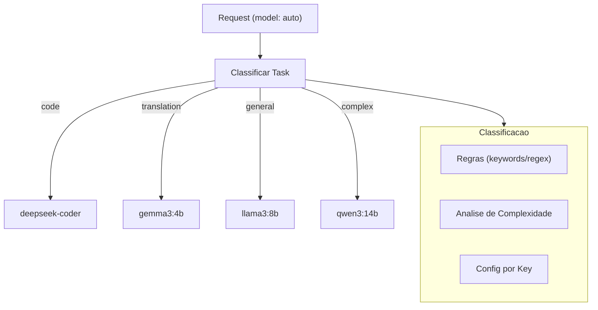

# RF-18 — Request Router (auto)

- **RF:** RF-18
- **Titulo:** Request Router (auto)
- **Autor:** HERMES Team
- **Data:** 2026-03-09
- **Versao:** 1.0
- **Status:** IMPLEMENTADO

## Objetivo

Plugin que analisa o conteudo do prompt e roteia automaticamente para o modelo mais adequado. O cliente envia `model: "auto"` e o gateway decide qual modelo usar baseado no tipo de tarefa, complexidade, custo e latencia desejada. Permite otimizar custo e qualidade sem que o cliente precise conhecer os modelos disponiveis.

## Escopo

- **Inclui:** Roteamento quando model=auto; classificacao por keywords; rules por task type; default_model; trigger_models (auto, default); headers X-Routed-Model e X-Task-Type; complexity_threshold para simple/complex
- **Nao inclui:** Classificacao por LLM (opcional, adiciona latencia); fallback quando modelo indisponivel; cache por modelo

## Descricao Funcional Detalhada

### Arquitetura



### Componentes

- **RequestRouterPlugin**: Plugin principal.
- **TaskClassifier**: Classifica o tipo de tarefa baseado no conteudo.
- **RoutingRule**: Regra que mapeia tipo de tarefa para modelo.

## Interface / Contrato

```cpp
enum class TaskType {
    Code,
    Translation,
    Summarization,
    Analysis,
    Creative,
    Math,
    General,
    Simple
};

struct RoutingRule {
    TaskType task;
    std::string model;
    int priority;  // menor = maior prioridade
};

struct ClassificationResult {
    TaskType type;
    float confidence;
    std::string reasoning;
};

class RequestRouterPlugin : public Plugin {
public:
    std::string name() const override { return "request_router"; }
    std::string version() const override { return "1.0.0"; }

    bool init(const Json::Value& config) override;

    PluginResult before_request(Json::Value& body,
                                 RequestContext& ctx) override;

    PluginResult after_response(Json::Value& response,
                                 RequestContext& ctx) override;

private:
    std::vector<RoutingRule> rules_;
    std::string default_model_;
    bool use_classifier_model_ = false;
    std::string classifier_model_;

    struct KeywordRule {
        std::vector<std::string> keywords;
        TaskType task;
    };
    std::vector<KeywordRule> keyword_rules_;

    [[nodiscard]] ClassificationResult classify(
        const Json::Value& messages) const;

    [[nodiscard]] std::string select_model(
        TaskType type, const RequestContext& ctx) const;

    [[nodiscard]] TaskType classify_by_keywords(
        const std::string& text) const;

    [[nodiscard]] int estimate_complexity(
        const Json::Value& messages) const;
};
```

## Configuracao

```json
{
  "plugins": {
    "pipeline": [
      {
        "name": "request_router",
        "enabled": true,
        "config": {
          "trigger_models": ["auto", "default"],
          "default_model": "llama3:8b",
          "rules": [
            {"task": "code", "model": "deepseek-coder:6.7b", "priority": 1},
            {"task": "translation", "model": "gemma3:4b", "priority": 1},
            {"task": "summarization", "model": "llama3:8b", "priority": 1},
            {"task": "math", "model": "qwen3:8b", "priority": 1},
            {"task": "creative", "model": "llama3:8b", "priority": 1},
            {"task": "complex", "model": "qwen3:14b", "priority": 1},
            {"task": "simple", "model": "gemma3:1b", "priority": 1}
          ],
          "keyword_classification": {
            "code": ["code", "function", "class", "debug", "implement", "refactor", "compile", "syntax"],
            "translation": ["translate", "traduz", "translation", "idioma", "language"],
            "summarization": ["summarize", "summary", "resume", "resuma", "tldr"],
            "math": ["calculate", "equation", "formula", "math", "integral", "derivative"]
          },
          "complexity_threshold": {
            "simple_max_tokens": 50,
            "complex_min_tokens": 500
          },
          "use_classifier_model": false,
          "classifier_model": "llama3:8b"
        }
      }
    ]
  }
}
```

## Endpoints

N/A — plugin de pipeline. Headers na response: `X-Routed-Model`, `X-Task-Type`.

## Regras de Negocio

1. Quando `model` esta em `trigger_models` (ex: "auto"), o plugin classifica e substitui pelo modelo adequado.
2. Classificacao por keywords: primeiro match define o task type.
3. complexity_threshold: mensagens curtas (< simple_max_tokens) -> simple; longas (> complex_min_tokens) -> complex.
4. default_model e usado quando nenhuma regra aplica ou task e General.
5. Headers X-Routed-Model e X-Task-Type informam ao cliente qual modelo foi usado.

## Dependencias e Integracoes

- **Internas**: Feature 10 (Plugin System), Feature 01 (Multi-Provider)
- **Externas**: Nenhuma
- **Opcional**: Modelo classificador (LLM) para classificacao avancada

## Criterios de Aceitacao

- [ ] model=auto dispara roteamento
- [ ] Keywords classificam corretamente (code, translation, summarization, math)
- [ ] default_model e usado quando sem match
- [ ] Headers X-Routed-Model e X-Task-Type presentes na response
- [ ] complexity_threshold aplicado para simple/complex

## Riscos e Trade-offs

1. **Classificacao por keywords**: Simples mas imprecisa. "Can you code me a poem?" seria classificado como "code" erroneamente.
2. **Classificacao por LLM**: Mais precisa mas adiciona latencia de uma inferencia extra.
3. **Modelo indisponivel**: Se o modelo selecionado nao esta carregado, precisa de fallback.
4. **Cache**: Requests com model=auto podem ser roteadas para modelos diferentes. Cache fragmentado.
5. **Transparencia**: Cliente precisa saber qual modelo foi usado (via headers).
6. **Streaming**: Modelo selecionado antes do streaming iniciar.

## Status de Implementacao

IMPLEMENTADO — Plugin Request Router funcional com model=auto, keyword matching e default_model.

## Checklist de Qualidade

- [ ] Objetivo claro e testavel
- [ ] Escopo dentro/fora definido
- [ ] Regras de negocio sem ambiguidade
- [ ] Criterios de aceitacao verificaveis
- [ ] Excecoes e limites cobertos
