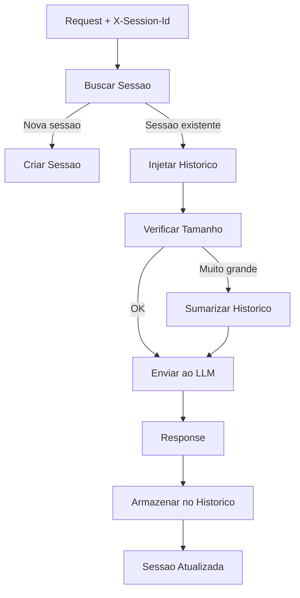

# RF-19 — Conversation Memory

- **RF:** RF-19
- **Titulo:** Conversation Memory
- **Autor:** HERMES Team
- **Data:** 2026-03-09
- **Versao:** 1.0
- **Status:** IMPLEMENTADO

## Objetivo

Plugin que armazena e gerencia historico de conversas no gateway, permitindo que clientes enviem apenas a ultima mensagem enquanto o plugin injeta automaticamente as mensagens anteriores. Inclui sumarizacao automatica quando o historico excede o context window, e API para gerenciar sessoes.

## Escopo

- **Inclui:** Header X-Session-Id para identificar sessao; armazenamento de mensagens por sessao; injecao de historico no before_request; armazenamento da response do assistant no after_response; max_messages e max_tokens; session_ttl_seconds; persist_directory; endpoints GET/DELETE /v1/sessions
- **Nao inclui:** Armazenamento de mensagens do usuario (apenas assistant); sumarizacao automatica (planejada); persistencia em disco completa

## Descricao Funcional Detalhada

### Arquitetura



## Interface / Contrato

```cpp
struct Session {
    std::string id;
    std::string key_alias;
    std::vector<Json::Value> messages;
    std::string summary;
    int64_t created_at;
    int64_t last_activity;
    int total_tokens;
};

class ConversationMemoryPlugin : public Plugin {
public:
    std::string name() const override { return "conversation_memory"; }
    std::string version() const override { return "1.0.0"; }

    bool init(const Json::Value& config) override;
    void shutdown() override;

    PluginResult before_request(Json::Value& body,
                                 RequestContext& ctx) override;

    PluginResult after_response(Json::Value& response,
                                 RequestContext& ctx) override;

private:
    mutable std::shared_mutex mtx_;
    std::unordered_map<std::string, Session> sessions_;
    int max_messages_ = 50;
    int max_tokens_ = 4000;
    int summarize_threshold_ = 3000;
    int session_ttl_seconds_ = 3600;
    std::string persist_dir_;
    std::string summarize_model_;

    void inject_history(Json::Value& body, Session& session);
    void summarize_session(Session& session);
    void cleanup_expired();
    void persist_session(const Session& session);
    void load_sessions();
};
```

## Configuracao

```json
{
  "plugins": {
    "pipeline": [
      {
        "name": "conversation_memory",
        "enabled": true,
        "config": {
          "max_messages": 50,
          "max_tokens": 4000,
          "summarize_threshold": 3000,
          "summarize_model": "llama3:8b",
          "session_ttl_seconds": 3600,
          "persist_directory": "sessions/",
          "session_header": "X-Session-Id"
        }
      }
    ]
  }
}
```

## Endpoints

| Metodo | Path | Descricao |
|---|---|---|
| `GET` | `/v1/sessions` | Listar sessoes ativas |
| `GET` | `/v1/sessions/{id}` | Ver historico de uma sessao |
| `DELETE` | `/v1/sessions/{id}` | Encerrar sessao |

### Response de `/v1/sessions/{id}`

```json
{
  "id": "sess_abc123",
  "key_alias": "dev-team",
  "messages": 12,
  "total_tokens": 2850,
  "summary": "Discussion about C++ gateway architecture...",
  "created_at": 1740355200,
  "last_activity": 1740358800
}
```

## Regras de Negocio

1. X-Session-Id identifica a sessao. Ausente = nova sessao por request.
2. before_request: injeta mensagens armazenadas antes da ultima mensagem do usuario.
3. after_response: armazena a mensagem do assistant no historico da sessao.
4. **Gap atual**: Mensagens do usuario nao sao armazenadas — apenas assistant. O historico completo requer armazenar user + assistant.
5. max_messages e max_tokens limitam o tamanho do historico injetado.
6. summarize_threshold dispara sumarizacao (planejado) quando historico excede.
7. session_ttl_seconds define expiracao; cleanup remove sessoes expiradas.

## Dependencias e Integracoes

- **Internas**: Feature 10 (Plugin System), `OllamaClient` (para sumarizacao)
- **Externas**: Nenhuma

## Criterios de Aceitacao

- [ ] X-Session-Id cria/identifica sessao
- [ ] Historico e injetado no before_request
- [ ] Mensagens do assistant sao armazenadas no after_response
- [ ] Mensagens do usuario sao armazenadas (correcao do gap)
- [ ] Endpoints GET/DELETE /v1/sessions funcionam
- [ ] Sumarizacao quando historico excede threshold (quando implementada)

## Riscos e Trade-offs

1. **Memoria**: Cada sessao consome memoria. TTL e cleanup essenciais.
2. **Sumarizacao**: Usar LLM para sumarizar adiciona latencia. Pode ser em background.
3. **Concorrencia**: Duas requests da mesma sessao podem causar race conditions. Serializar por sessao.
4. **Context window**: Historico completo pode exceder context window. Truncar ou sumarizar.
5. **Persistencia em disco**: Sessoes em disco sobrevivem a restarts mas adicionam I/O.
6. **Compatibilidade**: X-Session-Id nao faz parte da API OpenAI. Clientes padrao nao enviam.

## Status de Implementacao

IMPLEMENTADO — ConversationMemoryPlugin completado com: armazenamento de mensagens user + assistant, X-Session-Id header, session TTL com cleanup periodico, trim por max_messages, endpoints GET /v1/sessions, GET /v1/sessions/{id}, DELETE /v1/sessions/{id}. Sumarizacao automatica planejada para versao futura. Persistencia de sessoes em disco via opcao de config `persist_path`; sessoes salvas periodicamente (a cada 60s quando dirty) e no shutdown; sessoes carregadas no init com filtro TTL; mecanismo de dirty flag para evitar writes desnecessarios.

## Checklist de Qualidade

- [ ] Objetivo claro e testavel
- [ ] Escopo dentro/fora definido
- [ ] Regras de negocio sem ambiguidade
- [ ] Criterios de aceitacao verificaveis
- [ ] Excecoes e limites cobertos
