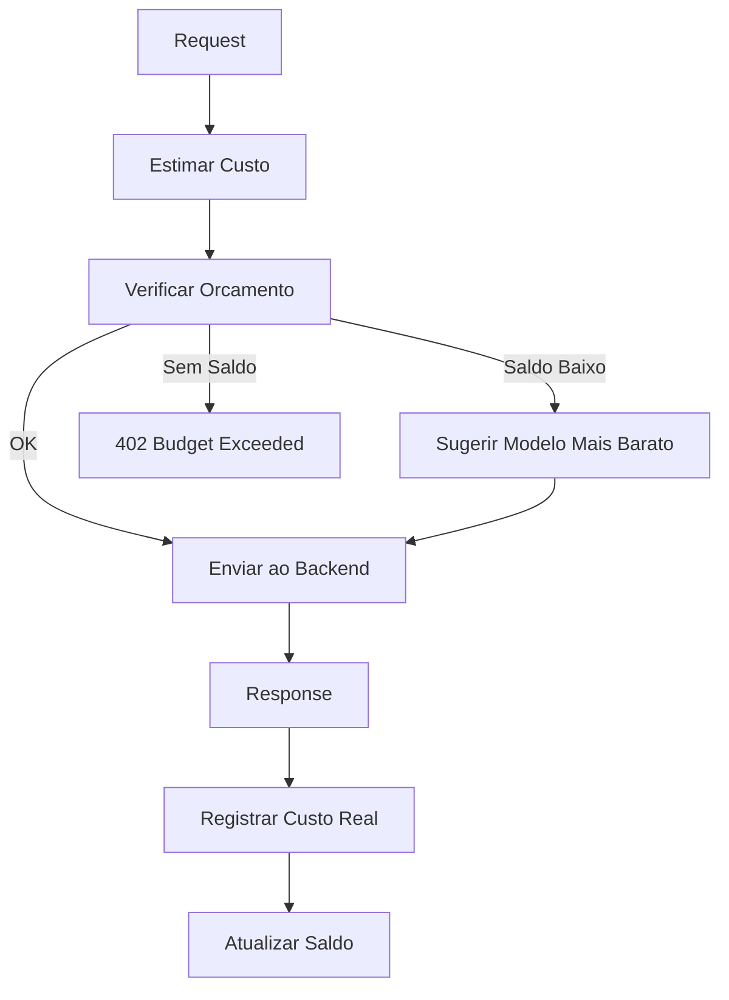

# RF-20 — Cost Controller

- **RF:** RF-20
- **Titulo:** Cost Controller
- **Autor:** HERMES Team
- **Data:** 2026-03-09
- **Versao:** 1.0
- **Status:** IMPLEMENTADO

## Objetivo

Plugin que monitora e controla custos de uso do LLM em tempo real. Estima o custo de cada request baseado no modelo e numero de tokens, mantem um saldo por API key, e bloqueia requests quando o orcamento e excedido. Pode sugerir modelos mais baratos quando o saldo esta baixo.

## Escopo

- **Inclui:** PricingTable por modelo (input_per_1k, output_per_1k); budget por key (monthly_limit_usd, daily_limit_usd); estimate_cost; bloqueio com HTTP 402 quando orcamento excedido; fallback_model; warning_threshold; header X-Cost-Estimate e X-Budget-Remaining; endpoints GET/PUT /admin/costs
- **Nao inclui:** Persistencia de saldos em disco; estimate_cost real (atualmente retorna valor fixo); record_cost com tokens reais; downgrade automatico para modelo mais barato

## Descricao Funcional Detalhada

### Arquitetura



### Componentes

- **CostControllerPlugin**: Plugin principal.
- **PricingTable**: Tabela de precos por modelo ($/1K tokens input, $/1K tokens output).
- **BudgetManager**: Gerencia saldos por API key.

## Interface / Contrato

```cpp
struct ModelPricing {
    double input_per_1k_tokens;   // USD per 1K input tokens
    double output_per_1k_tokens;  // USD per 1K output tokens
};

struct Budget {
    double monthly_limit_usd;
    double daily_limit_usd;
    double spent_monthly_usd;
    double spent_daily_usd;
    int64_t period_start;
};

class CostControllerPlugin : public Plugin {
public:
    std::string name() const override { return "cost_controller"; }
    std::string version() const override { return "1.0.0"; }

    bool init(const Json::Value& config) override;

    PluginResult before_request(Json::Value& body,
                                 RequestContext& ctx) override;

    PluginResult after_response(Json::Value& response,
                                 RequestContext& ctx) override;

private:
    std::unordered_map<std::string, ModelPricing> pricing_;
    std::unordered_map<std::string, Budget> budgets_;
    mutable std::shared_mutex mtx_;
    std::string fallback_model_;
    double warning_threshold_ = 0.8;  // 80%

    [[nodiscard]] double estimate_cost(const std::string& model,
                                        int estimated_tokens) const;
    void record_cost(const std::string& key_alias,
                      const std::string& model,
                      int input_tokens, int output_tokens);
    [[nodiscard]] std::optional<std::string> cheaper_alternative(
        const std::string& model) const;
};
```

## Configuracao

```json
{
  "plugins": {
    "pipeline": [
      {
        "name": "cost_controller",
        "enabled": true,
        "config": {
          "pricing": {
            "gpt-4o": {"input_per_1k": 0.0025, "output_per_1k": 0.01},
            "gpt-3.5-turbo": {"input_per_1k": 0.0005, "output_per_1k": 0.0015},
            "llama3:8b": {"input_per_1k": 0.0, "output_per_1k": 0.0},
            "claude-3.5-sonnet": {"input_per_1k": 0.003, "output_per_1k": 0.015}
          },
          "budgets": {
            "dev-team": {"monthly_limit_usd": 100, "daily_limit_usd": 10},
            "prod-app": {"monthly_limit_usd": 500, "daily_limit_usd": 50}
          },
          "default_monthly_limit_usd": 50,
          "fallback_model": "llama3:8b",
          "warning_threshold": 0.8,
          "add_cost_header": true
        }
      }
    ]
  }
}
```

## Endpoints

| Metodo | Path | Descricao |
|---|---|---|
| `GET` | `/admin/costs` | Custos agregados de todas as keys |
| `GET` | `/admin/costs/{alias}` | Custo detalhado de uma key |
| `PUT` | `/admin/costs/{alias}/budget` | Definir orcamento de uma key |

### Response de `/admin/costs/{alias}`

```json
{
  "alias": "dev-team",
  "budget": {
    "monthly_limit_usd": 100.00,
    "daily_limit_usd": 10.00,
    "spent_monthly_usd": 47.23,
    "spent_daily_usd": 3.15,
    "remaining_monthly_usd": 52.77,
    "used_percentage": 47.23
  },
  "by_model": {
    "gpt-4o": {"requests": 230, "cost_usd": 35.50},
    "llama3:8b": {"requests": 1500, "cost_usd": 0.00},
    "gpt-3.5-turbo": {"requests": 420, "cost_usd": 11.73}
  }
}
```

## Regras de Negocio

1. before_request: estima custo, verifica orcamento. Se excedido, retorna HTTP 402 com `type: budget_error`.
2. Saldo baixo (>= warning_threshold): pode sugerir fallback_model ou adicionar header de aviso.
3. after_response: record_cost atualiza spent_monthly e spent_daily.
4. **Gap atual**: estimate_cost retorna valor fixo; nao usa tokens reais.
5. **Gap atual**: Persistencia de budgets em disco nao implementada — saldos perdem-se no restart.
6. add_cost_header: X-Cost-Estimate e X-Budget-Remaining na response.

## Dependencias e Integracoes

- **Internas**: Feature 10 (Plugin System), Feature 02 (Usage Tracking) para contagens de tokens
- **Externas**: Nenhuma

## Criterios de Aceitacao

- [ ] Orcamento excedido retorna 402
- [ ] estimate_cost usa tokens estimados/reais e pricing table
- [ ] record_cost atualiza saldos apos cada request
- [ ] Headers X-Cost-Estimate e X-Budget-Remaining quando add_cost_header=true
- [ ] Persistencia de budgets em disco
- [ ] fallback_model sugerido quando saldo baixo (quando implementado)

## Riscos e Trade-offs

1. **Estimativa vs real**: Custo antes da request e estimado. Custo real so apos a response.
2. **Modelos locais**: Ollama tem custo zero em USD mas usa GPU.
3. **Precos desatualizados**: Providers mudam precos. Tabela precisa ser atualizada.
4. **Moeda**: Custos em USD.
5. **Streaming**: Custo total so apos o final do stream. X-Cost-Estimate nao disponivel em streaming.
6. **Persistencia**: Saldos devem ser persistidos em disco para sobreviver a restarts.

## Status de Implementacao

IMPLEMENTADO — CostControllerPlugin reescrito com: PricingTable por modelo (input/output per 1K tokens), estimate_cost real baseado em tokens estimados, record_cost com tokens reais, budgets por key (daily/monthly), rotacao de periodos UTC, persistencia em costs.json, headers X-Cost-Estimate e X-Budget-Remaining, IAuditSink integration, endpoints GET /admin/costs, GET /admin/costs/{alias}, PUT /admin/costs/{alias}/budget.

## Checklist de Qualidade

- [ ] Objetivo claro e testavel
- [ ] Escopo dentro/fora definido
- [ ] Regras de negocio sem ambiguidade
- [ ] Criterios de aceitacao verificaveis
- [ ] Excecoes e limites cobertos
