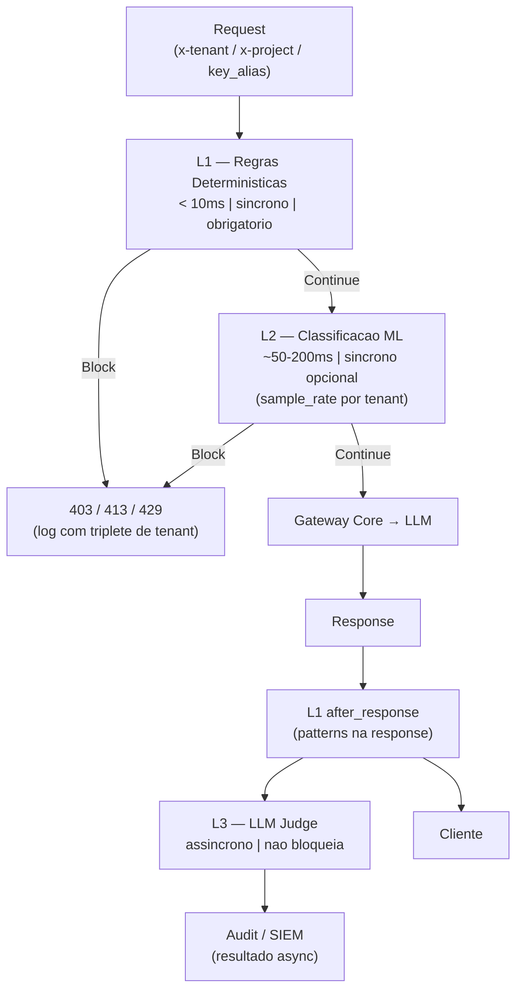

# RF-32 — GuardRails (LLM Firewall)

- **RF:** RF-32
- **Titulo:** GuardRails — LLM Firewall
- **Autor:** HERMES Team
- **Data:** 2026-03-23
- **Versao:** 1.0
- **Status:** RASCUNHO

## Objetivo

Plugin orquestrador de segurança que implementa um pipeline em camadas L1/L2/L3 para inspeção e controle de requests e responses ao LLM. Cada camada adiciona profundidade de análise com custo progressivo de latência: L1 é síncrono e obrigatório (<10ms); L2 é ML opcional e configurável (~50-200ms); L3 é LLM Judge assíncrono (não bloqueia o pipeline crítico). Políticas são escopadas por `tenant_id + app_id`, garantindo isolamento multi-tenant. Estende e orquestra RF-13 (PII Redaction), RF-14 (Content Moderation) e RF-15 (Prompt Injection) sem substituí-los.

## Escopo

- **Inclui:** Pipeline L1 (payload size, allow/deny models, rate limit por tenant/client_id, regex/patterns herdados de RF-13/15); L2 ML opcional (toxicity, NER, jailbreak via ONNX); L3 LLM Judge assíncrono; PolicyBundle por tenant+app; propagação de tenant/app/client_id em todos os eventos; endpoint `/admin/guardrails/stats`; comportamento no dashboard: stats via plugin card genérico
- **Nao inclui:** Firewall de rede; inspeção de chunks SSE em L2/L3 (apenas body completo); substituição de RF-13, RF-14 ou RF-15 quando usados como plugins independentes; hot-reload de políticas sem restart; tela dedicada no dashboard (fora do escopo desta spec)

## Descricao Funcional Detalhada

### Arquitetura do Pipeline



### L1 — Regras Deterministicas

Executado em `before_request` e `after_response`. Síncrono, obrigatório, sem dependências externas. Verificações em ordem:

1. **Payload size:** recusa se body > `max_payload_bytes` (default 1 MiB) → HTTP 413
2. **Allow/deny models:** verifica `ctx.model` contra listas por tenant+app → HTTP 403
3. **Rate limit por tenant:client_id:** token bucket por `"{tenant}:{key_alias}"` → HTTP 429
4. **Regex patterns (injection/PII):** score ponderado por patterns configurados; bloqueia se `score >= block_threshold_l1`

### L2 — Classificacao ML (opcional)

Executado após L1 passar, apenas quando `l2.enabled: true` e `random() < l2.sample_rate`. Usa classificador ONNX (toxicity, jailbreak, NER) ou delega a endpoint externo. O `sample_rate` por tenant controla custo de latência em produção.

### L3 — LLM Judge (assincrono)

Agenda análise semântica após response enviada ao cliente. Nunca bloqueia. Usa `l3.sample_rate` para controle de volume. Resultado gravado no audit sink com `{tenant_id, app_id, client_id, verdict, score}`.

### Resolucao de PolicyBundle

```cpp
// init(): carrega politicas globais e por tenant
// before_request(): resolve bundle por "tenant:app"
const PolicyBundle& bundle = resolve_bundle(ctx_tenant(ctx), ctx_app(ctx));
```

### Helper de Contexto (padrao transversal)

```cpp
inline std::string ctx_tenant(const RequestContext& ctx) {
    auto it = ctx.metadata.find("tenant_id");
    return (it != ctx.metadata.end() && !it->second.empty()) ? it->second : "default";
}
inline std::string ctx_app(const RequestContext& ctx) {
    auto it = ctx.metadata.find("app_id");
    return (it != ctx.metadata.end() && !it->second.empty()) ? it->second : "default";
}
// client_id == ctx.key_alias
```

O gateway core popula `ctx.metadata["tenant_id"]` e `ctx.metadata["app_id"]` a partir dos headers `x-tenant` e `x-project` antes de iniciar o pipeline (adendo ao RF-10).

## Interface / Contrato

```cpp
struct AllowDenyList {
    std::vector<std::string> allow_models;  // vazio = todos permitidos
    std::vector<std::string> deny_models;
};

struct RateLimitPolicy {
    int requests_per_minute = 0;  // 0 = sem limite
    int burst = 0;
};

struct L1Policy {
    size_t max_payload_bytes = 1048576;
    AllowDenyList model_filter;
    RateLimitPolicy rate_limit;
    float block_threshold = 0.7f;
    std::vector<std::string> trusted_client_ids;  // bypassam pattern matching e L2
};

struct L2Policy {
    bool enabled = false;
    float sample_rate = 1.0f;           // 0.0–1.0
    float toxicity_threshold = 0.8f;
    float jailbreak_threshold = 0.7f;
    std::string onnx_model_path;
};

struct L3Policy {
    bool enabled = false;
    float sample_rate = 0.1f;
    std::string judge_model;            // ex: "llama3:8b"
};

struct PolicyBundle {
    std::string tenant_id;
    std::string app_id;
    L1Policy l1;
    L2Policy l2;
    L3Policy l3;
};

struct GuardrailsEvent {
    std::string request_id;
    std::string tenant_id;
    std::string app_id;
    std::string client_id;
    std::string layer;      // "L1" | "L2" | "L3"
    std::string action;     // "block" | "warn" | "pass"
    float score;
    std::string reason;
    int64_t timestamp_ms;
};

class GuardrailsPlugin : public Plugin {
public:
    std::string name()    const override { return "guardrails"; }
    std::string version() const override { return "1.0.0"; }

    bool init(const Json::Value& config) override;
    PluginResult before_request(Json::Value& body, RequestContext& ctx) override;
    PluginResult after_response(Json::Value& response, RequestContext& ctx) override;

    [[nodiscard]] Json::Value stats() const;

private:
    std::unordered_map<std::string, PolicyBundle> bundles_;  // key: "tenant:app"
    PolicyBundle default_bundle_;
    mutable std::shared_mutex mtx_;

    std::unordered_map<std::string, TokenBucket> rate_buckets_;  // key: "tenant:client_id"

    [[nodiscard]] const PolicyBundle& resolve_bundle(
        const std::string& tenant, const std::string& app) const;

    PluginResult evaluate_l1(const Json::Value& body,
                              const RequestContext& ctx,
                              const PolicyBundle& bundle);

    PluginResult evaluate_l2(const Json::Value& body,
                              const RequestContext& ctx,
                              const PolicyBundle& bundle);

    void schedule_l3(const Json::Value& response,
                     const RequestContext& ctx,
                     const PolicyBundle& bundle);

    void emit_event(const GuardrailsEvent& ev);
};
```

## Configuracao

```json
{
  "plugins": {
    "pipeline": [
      {
        "name": "guardrails",
        "enabled": true,
        "config": {
          "default_policy": {
            "l1": {
              "max_payload_bytes": 1048576,
              "allow_models": [],
              "deny_models": [],
              "rate_limit": { "requests_per_minute": 60, "burst": 10 },
              "block_threshold": 0.7,
              "trusted_client_ids": ["internal-admin"]
            },
            "l2": { "enabled": false, "sample_rate": 1.0, "toxicity_threshold": 0.8, "jailbreak_threshold": 0.7 },
            "l3": { "enabled": false, "sample_rate": 0.1, "judge_model": "llama3:8b" }
          },
          "tenant_policies": {
            "acme:payments-app": {
              "l1": {
                "max_payload_bytes": 524288,
                "deny_models": ["gpt-4-unrestricted"],
                "rate_limit": { "requests_per_minute": 30, "burst": 5 }
              },
              "l2": { "enabled": true, "sample_rate": 0.5, "toxicity_threshold": 0.75 },
              "l3": { "enabled": true, "sample_rate": 0.05, "judge_model": "llama3:8b" }
            }
          }
        }
      }
    ]
  }
}
```

### Variaveis de Ambiente

| Variavel | Descricao | Default |
|----------|-----------|---------|
| `GUARDRAILS_ENABLED` | Habilitar plugin | `false` |
| `GUARDRAILS_MAX_PAYLOAD_BYTES` | Limite global de payload | `1048576` |
| `GUARDRAILS_DENY_MODELS` | Modelos negados global (CSV) | `` |
| `GUARDRAILS_L2_ENABLED` | Habilitar L2 ML globalmente | `false` |
| `GUARDRAILS_L3_ENABLED` | Habilitar L3 LLM Judge | `false` |

## Endpoints

| Metodo | Path | Auth | Descricao |
|--------|------|------|-----------|
| `GET` | `/admin/guardrails/stats` | ADMIN_KEY | Estatisticas agregadas por tenant e por camada |

### Response `/admin/guardrails/stats`

```json
{
  "total_requests": 84200,
  "total_blocked": 312,
  "block_rate": 0.0037,
  "by_tenant": {
    "acme": {
      "requests": 42100,
      "blocked": 187,
      "by_layer": {
        "L1": {
          "blocked": 150,
          "reasons": {
            "payload_size": 12,
            "model_denied": 38,
            "rate_limit": 60,
            "pattern_match": 40
          }
        },
        "L2": { "blocked": 37, "sampled": 21050, "avg_score": 0.83 },
        "L3": { "sampled": 210, "flagged": 4 }
      }
    }
  }
}
```

## Regras de Negocio

1. L1 sempre executa para todo request; L2 e L3 são opcionais e configuráveis por tenant+app.
2. Payload acima de `max_payload_bytes` retorna HTTP 413 antes de qualquer outra verificação.
3. Modelo em `deny_models` retorna HTTP 403 `{"error":{"type":"model_denied","message":"Model not allowed for this tenant"}}`.
4. Rate limit excedido retorna HTTP 429 com header `Retry-After` — bucket scoped a `"{tenant}:{client_id}"`.
5. `trusted_client_ids` bypassam pattern matching L1 e L2; **nunca** bypassam payload size check.
6. L3 é fire-and-forget: exceção no L3 é capturada e logada, nunca propaga para o handler principal.
7. PolicyBundle `"default"` é usado quando tenant não tem política específica — deve ser o mais restritivo.
8. Todos os eventos de bloqueio incluem `{tenant_id, app_id, client_id, layer, score, reason}`.
9. Fallback para `tenant_id="default"` quando header `x-tenant` ausente — backward compatibility.

## Dependencias e Integracoes

- **Internas:** RF-10 (Plugin System), RF-13 (patterns PII no L1), RF-14 (categorias de conteúdo no L2), RF-15 (patterns de injection no L1)
- **Externas:** ONNX Runtime (opcional, para L2); backend LLM configurado (para L3 LLM Judge)
- **Contexto:** gateway core popula `ctx.metadata["tenant_id"]` e `ctx.metadata["app_id"]` antes do pipeline — adendo ao RF-10
- **Ver RF-32-AI.md** para especificação detalhada do comportamento ML das camadas L2 e L3

## Criterios de Aceitacao

- [ ] Payload acima do limite retorna 413; log inclui tenant_id, app_id, client_id
- [ ] Modelo em deny_models retorna 403 usando PolicyBundle correto por tenant+app
- [ ] Rate limit por `tenant:client_id` bloqueia com 429 e header Retry-After
- [ ] `trusted_client_ids` bypassa pattern matching mas não payload size check
- [ ] L2 executado apenas quando `l2.enabled: true` e conforme `sample_rate` do tenant
- [ ] L3 executa assincronamente; response ao cliente não é atrasada por L3
- [ ] PolicyBundle `"default"` aplicado quando tenant sem política configurada
- [ ] Fallback para tenant="default" quando header `x-tenant` ausente
- [ ] GET /admin/guardrails/stats retorna breakdown por tenant e por layer
- [ ] Todos os eventos de bloqueio contêm triplete {tenant_id, app_id, client_id}

## Riscos e Trade-offs

1. **Latencia L2:** Classificador ONNX adiciona 50-200ms; usar `sample_rate < 1.0` em produção para controle de custo.
2. **L3 assíncrono:** Consome recursos de backend LLM; monitorar throughput separado do pipeline principal.
3. **PolicyBundle em memória:** Mudanças de política exigem restart do gateway — sem hot-reload nesta versão.
4. **Contenção no rate bucket:** `shared_mutex` protege os buckets; alta concorrência por tenant pode gerar contenção — considerar shard por tenant em versão futura.
5. **Falsos positivos em L1:** Patterns agressivos bloqueiam requests legítimas; calibrar `block_threshold` por tenant.
6. **Streaming:** L2/L3 operam sobre body completo; em streaming, apenas L1 é aplicável chunk-a-chunk.
7. **Isolamento de tenant:** `resolve_bundle` usa chave composta `"tenant:app"` — teste de isolamento obrigatório.

## Status de Implementacao

RASCUNHO — Especificação definida. Implementação pendente. Pré-requisitos: (1) gateway core popular `ctx.metadata` com `tenant_id`/`app_id` (adendo RF-10); (2) ONNX Runtime para L2; (3) backend LLM acessível para L3.

## Checklist de Qualidade

- [ ] Objetivo claro e testavel
- [ ] Escopo dentro/fora definido
- [ ] Regras de negocio sem ambiguidade
- [ ] Criterios de aceitacao verificaveis
- [ ] Excecoes e limites cobertos
