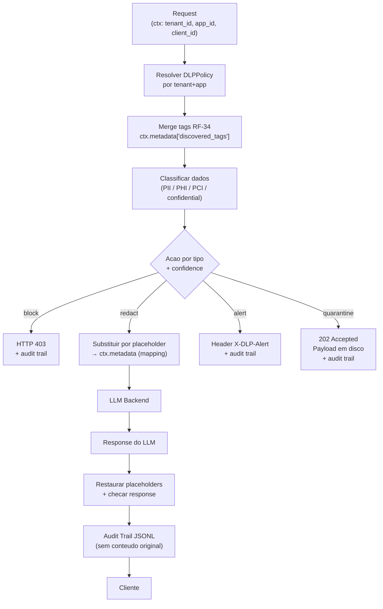

# RF-33 — DLP (Data Loss Prevention)

- **RF:** RF-33
- **Titulo:** DLP — Data Loss Prevention
- **Autor:** HERMES Team
- **Data:** 2026-03-23
- **Versao:** 1.0
- **Status:** RASCUNHO

## Objetivo

Plugin que previne vazamento de dados sensíveis em requests e responses ao LLM. Estende o RF-13 (PII Redaction) com suporte a dados de saúde (PHI/HIPAA) e financeiros (PCI/DSS), ações adicionais de quarentena com revisão humana, e trilha de auditoria persistente append-only por tenant. Políticas são carregadas por `tenant_id + app_id`, garantindo isolamento multi-tenant. Integra com RF-34 (Data Discovery) consumindo tags de classificação escritas em `ctx.metadata["discovered_tags"]` para enforcement dinâmico — quando RF-34 está no pipeline antes do DLP, a cobertura de detecção é ampliada sem custo adicional de regex.

## Escopo

- **Inclui:** Detecção de PII/PHI/PCI em `before_request` e `after_response`; ações block/redact/alert/quarantine por tipo de dado e nível de confiança; políticas por tenant+app; trilha de auditoria persistente (JSONL append-only) por tenant sem conteúdo original; quarentena de payloads em disco; integração com tags do RF-34 via `ctx.metadata["discovered_tags"]`; endpoints `/admin/dlp/policies/{tenant_id}`, `/admin/dlp/quarantine/{tenant_id}`, `/admin/dlp/stats`; dashboard: stats via plugin card genérico
- **Nao inclui:** NER para nomes próprios (regex não cobre); validação de dígitos verificadores (CPF, CNPJ); storage externo de quarentena (disco local apenas); hot-reload de políticas sem restart; interface de revisão humana de itens em quarentena (fora do escopo desta spec); substituição do RF-13 (coexistem)

## Descricao Funcional Detalhada

### Arquitetura



### Tipos de Dados Detectados

| Categoria | Tipos | Regex base | Framework |
|-----------|-------|------------|-----------|
| PII | CPF, CNPJ, email, phone, credit_card | Herda RF-13 | LGPD, GDPR |
| PHI | CID-10, número de prontuário, número de paciente | `[A-Z]\d{2}`, `prontuário:\s*\d+` | HIPAA |
| PCI | Número de cartão, CVV, data de expiração, conta bancária | `\d{4}[\s-]?\d{4}[\s-]?\d{4}[\s-]?\d{4}`, `CVV[:\s]?\d{3,4}` | PCI-DSS |
| Confidencial | Custom patterns via regex por tenant | Configurável | Interno |

### Integracao com RF-34 (Data Discovery)

Quando RF-34 executa antes do DLP no pipeline, escreve em `ctx.metadata["discovered_tags"]` uma string CSV com as tags detectadas (ex: `"pii,phi"`). O DLP faz merge dessas tags com sua classificação própria, tratando-as como `confidence = 1.0` (já classificadas com confiança máxima):

```cpp
// Leitura de tags do RF-34
std::string tags_str = ctx.metadata.count("discovered_tags")
    ? ctx.metadata.at("discovered_tags") : "";
// Merge com classificacao propria do DLP
auto external_tags = split(tags_str, ',');
```

### Acao de Quarentena

Quando `action: quarantine`:
1. Payload completo armazenado em `{quarantine_path}/{tenant_id}/{YYYY-MM-DD}/{request_id}.json`
2. HTTP 202 Accepted retornado ao cliente (request **não** enviada ao LLM)
3. Entrada gravada no audit trail com `{action:"quarantine", tenant_id, app_id, client_id, data_types[]}`

### Redaction e Restauracao

Idêntico ao RF-13 (reutiliza o mecanismo): placeholders como `[PII_1]`, `[PHI_1]`, `[PCI_1]` substituem o conteúdo no `before_request`. O mapeamento `placeholder → valor_original` é armazenado em `ctx.metadata["dlp_mapping_{uuid}"]`. No `after_response`, placeholders na response do LLM são restaurados antes de entregar ao cliente.

## Interface / Contrato

```cpp
enum class DLPAction { Block, Redact, Alert, Quarantine };

struct DataTypePolicy {
    std::string data_type;              // "pii" | "phi" | "pci" | "confidential"
    DLPAction action = DLPAction::Redact;
    float confidence_threshold = 0.8f;
    bool check_request  = true;
    bool check_response = true;
};

struct DLPPolicy {
    std::string tenant_id;
    std::string app_id;
    std::vector<DataTypePolicy> type_policies;
    std::vector<std::string> custom_patterns;   // regex extras por tenant
    bool log_detections = true;
    bool audit_trail    = true;
    std::string quarantine_path;
};

struct DLPDetection {
    std::string data_type;
    float confidence;
    DLPAction action;
    std::string placeholder;    // ex: "[PCI_1]" (para redact)
};

struct DLPAuditEntry {
    std::string request_id;
    std::string tenant_id;
    std::string app_id;
    std::string client_id;
    int64_t timestamp_ms;
    std::string direction;                          // "request" | "response"
    std::vector<std::string> data_types_detected;
    std::string action_taken;
    std::string tags_from_discovery;                // ctx.metadata["discovered_tags"]
};

class DLPPlugin : public Plugin {
public:
    std::string name()    const override { return "dlp"; }
    std::string version() const override { return "1.0.0"; }

    bool init(const Json::Value& config) override;
    PluginResult before_request(Json::Value& body, RequestContext& ctx) override;
    PluginResult after_response(Json::Value& response, RequestContext& ctx) override;

    [[nodiscard]] Json::Value stats() const;

private:
    std::unordered_map<std::string, DLPPolicy> policies_;  // key: "tenant:app"
    DLPPolicy default_policy_;
    mutable std::shared_mutex mtx_;
    std::string audit_path_;

    [[nodiscard]] const DLPPolicy& resolve_policy(
        const std::string& tenant, const std::string& app) const;

    std::vector<DLPDetection> classify(const std::string& text,
                                        const DLPPolicy& policy,
                                        const std::vector<std::string>& external_tags) const;

    std::string apply_redaction(const std::string& text,
                                 const std::vector<DLPDetection>& detections,
                                 std::unordered_map<std::string, std::string>& mapping);

    std::string restore_redaction(const std::string& text,
                                   const std::unordered_map<std::string, std::string>& mapping) const;

    void quarantine_payload(const Json::Value& body,
                             const RequestContext& ctx,
                             const std::vector<DLPDetection>& detections);

    void append_audit(const DLPAuditEntry& entry);
};
```

### Patterns Builtin

| Pattern | Regex | Categoria |
|---------|-------|-----------|
| `cpf` | `\b\d{3}\.\d{3}\.\d{3}-\d{2}\b` | PII |
| `cnpj` | `\b\d{2}\.\d{3}\.\d{3}/\d{4}-\d{2}\b` | PII |
| `email` | `\b[A-Za-z0-9._%+-]+@[A-Za-z0-9.-]+\.[A-Za-z]{2,}\b` | PII |
| `phone_br` | `\b\(?\d{2}\)?[\s-]?\d{4,5}-?\d{4}\b` | PII |
| `credit_card` | `\b\d{4}[\s-]?\d{4}[\s-]?\d{4}[\s-]?\d{4}\b` | PCI |
| `cvv` | `\bCVV[:\s]?\d{3,4}\b` | PCI |
| `bank_account_br` | `\b(?:agência\|conta)[:\s]\d{4,6}-?\d{1}\b` | PCI |
| `cid10` | `\b[A-Z]\d{2}(?:\.\d)?\b` | PHI |
| `patient_id_br` | `\b(?:prontuário\|paciente)[:\s]\d{6,}\b` | PHI |

## Configuracao

```json
{
  "plugins": {
    "pipeline": [
      {
        "name": "dlp",
        "enabled": true,
        "config": {
          "audit_path": "data/dlp-audit",
          "quarantine_path": "data/dlp-quarantine",
          "default_policy": {
            "type_policies": [
              { "data_type": "pii", "action": "redact",     "confidence_threshold": 0.8 },
              { "data_type": "phi", "action": "block",      "confidence_threshold": 0.7 },
              { "data_type": "pci", "action": "quarantine", "confidence_threshold": 0.9 }
            ],
            "log_detections": true,
            "audit_trail": true
          },
          "tenant_policies": {
            "acme:payments-app": {
              "type_policies": [
                { "data_type": "pii", "action": "redact",     "confidence_threshold": 0.75 },
                { "data_type": "phi", "action": "block",      "confidence_threshold": 0.7  },
                { "data_type": "pci", "action": "quarantine", "confidence_threshold": 0.85 }
              ],
              "custom_patterns": ["ID-\\d{8}"],
              "audit_trail": true
            }
          }
        }
      }
    ]
  }
}
```

**Nota de pipeline:** `dlp` deve aparecer **após** `data_discovery` no array `pipeline` para consumir as tags de RF-34.

## Endpoints

| Metodo | Path | Auth | Descricao |
|--------|------|------|-----------|
| `GET` | `/admin/dlp/stats` | ADMIN_KEY | Estatisticas globais por tenant |
| `GET` | `/admin/dlp/policies/{tenant_id}` | ADMIN_KEY | Politicas DLP do tenant |
| `GET` | `/admin/dlp/quarantine/{tenant_id}` | ADMIN_KEY | Itens em quarentena do tenant |

### Response `/admin/dlp/stats`

```json
{
  "by_tenant": {
    "acme": {
      "total_checked": 15200,
      "detections": { "pii": 423, "phi": 12, "pci": 8, "confidential": 37 },
      "actions": { "redacted": 398, "blocked": 12, "quarantined": 8, "alerted": 64 }
    }
  }
}
```

### Response `/admin/dlp/quarantine/{tenant_id}`

```json
{
  "tenant_id": "acme",
  "total": 8,
  "items": [
    {
      "request_id": "req-abc123",
      "timestamp": 1740355200,
      "app_id": "payments-app",
      "client_id": "sk-prod",
      "data_types": ["pci"],
      "quarantine_file": "data/dlp-quarantine/acme/2026-03-23/req-abc123.json"
    }
  ]
}
```

## Regras de Negocio

1. `block`: retorna HTTP 403 com `{"error":{"type":"data_policy_violation","data_type":"phi"}}`. Request não enviada ao LLM.
2. `redact`: substitui dados por placeholder (`[PII_1]`, `[PHI_1]`, `[PCI_1]`). Mapeamento em `ctx.metadata`. Restaurado no `after_response`.
3. `alert`: request prossegue. Adiciona header `X-DLP-Alert: pii (confidence: 0.85)`. Registra no audit trail.
4. `quarantine`: armazena payload em disco por tenant e retorna HTTP 202. Request **não** enviada ao LLM.
5. Tags do RF-34 em `ctx.metadata["discovered_tags"]` são tratadas com `confidence = 1.0` — sem segundo regex.
6. Audit trail (quando `audit_trail: true`): JSONL append-only por tenant; **nunca** inclui conteúdo original dos dados — apenas `data_types`, `action` e metadata de identidade.
7. PolicyBundle `"default"` aplicado quando tenant não tem política específica.
8. `check_response: true` (default): DLP também inspeciona a response do LLM antes de entregar ao cliente.
9. Fallback para `tenant_id="default"` quando header `x-tenant` ausente.

## Dependencias e Integracoes

- **Internas:** RF-10 (Plugin System), RF-13 (patterns PII base — DLP os estende com PHI/PCI e não os duplica), RF-34 (tags via `ctx.metadata["discovered_tags"]`)
- **Externas:** Nenhuma (regex built-in; sem dependência de NER externo)
- **Contexto:** `ctx.metadata["tenant_id"]` e `ctx.metadata["app_id"]` populados pelo gateway core (adendo RF-10); `ctx.metadata["discovered_tags"]` escrito pelo RF-34 quando presente no pipeline
- **Ordem no pipeline:** `dlp` DEVE suceder `data_discovery` para consumir as tags

## Criterios de Aceitacao

- [ ] PII detectado e redactado no `before_request`; placeholder restaurado no `after_response`
- [ ] PHI bloqueia request com 403; log inclui tenant_id, app_id, client_id, data_type
- [ ] PCI move payload para quarentena com 202; arquivo gravado em `quarantine/{tenant_id}/`
- [ ] Tags do RF-34 via `ctx.metadata["discovered_tags"]` são incorporadas à classificação com confidence=1.0
- [ ] Audit trail JSONL gerado por tenant sem conteúdo original dos dados
- [ ] Política por tenant+app carregada corretamente; fallback para `"default"`
- [ ] `GET /admin/dlp/policies/{tenant_id}` lista políticas do tenant
- [ ] `GET /admin/dlp/quarantine/{tenant_id}` lista itens com metadata (sem conteúdo)
- [ ] Fallback para tenant="default" quando `x-tenant` ausente

## Riscos e Trade-offs

1. **Regex PHI/PCI:** Padrões são aproximações — CID-10 tem alta variação; contas bancárias variam por país. Calibrar por idioma/país com `custom_patterns` por tenant.
2. **Quarentena em disco:** Sem TTL configurado, crescimento ilimitado. Implementar rotação por data (30 dias default) em versão futura.
3. **Acoplamento com RF-34:** Sem RF-34 no pipeline, DLP funciona apenas com seus próprios patterns — comportamento correto mas com cobertura reduzida.
4. **Conteúdo na auditoria:** Audit trail sem conteúdo original por design — protege privacidade mas impede replay de eventos.
5. **Redaction em streaming:** Placeholders podem ser divididos entre chunks SSE; buffering necessário para suporte completo a streaming.
6. **Performance:** Múltiplos regex em textos longos impactam latência; compilar todos os patterns em `init()` uma única vez.

## Status de Implementacao

RASCUNHO — Especificação definida. Implementação pendente. Pré-requisitos: gateway core popular `ctx.metadata` com `tenant_id`/`app_id` (adendo RF-10); RF-34 para integração de tags (opcional mas recomendado).

## Checklist de Qualidade

- [ ] Objetivo claro e testavel
- [ ] Escopo dentro/fora definido
- [ ] Regras de negocio sem ambiguidade
- [ ] Criterios de aceitacao verificaveis
- [ ] Excecoes e limites cobertos
