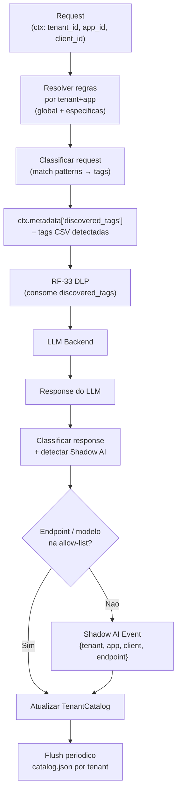

# RF-34 — Data Discovery (Classificacao e Catalogacao Continua)

- **RF:** RF-34
- **Titulo:** Data Discovery — Classificacao e Catalogacao Continua
- **Autor:** HERMES Team
- **Data:** 2026-03-23
- **Versao:** 1.0
- **Status:** RASCUNHO

## Objetivo

Plugin que classifica continuamente o conteúdo de prompts e respostas em trânsito, produzindo tags de sensibilidade (`pii`, `phi`, `pci`, `confidential`) escritas em `ctx.metadata["discovered_tags"]` para consumo pelo RF-33 (DLP) no mesmo pipeline. Mantém um catálogo em memória de assets classificados por tenant, detecta modelos e endpoints de IA não-inventariados (Shadow AI) e expõe APIs de consulta para auditoria e conformidade. Este plugin **não bloqueia requests** — sua responsabilidade é classificar e catalogar; o bloqueio é delegado ao RF-33. Deve executar **antes** do RF-33 (DLP) no `config.plugins.pipeline`.

## Escopo

- **Inclui:** Classificação por regras `{kind, pattern, tags}` por tenant+app (apenas `kind: "regex"` nesta versão); escrita de `ctx.metadata["discovered_tags"]` para RF-33; catálogo em memória `map<tenant_id, TenantCatalog>` com flush periódico por tenant; Shadow AI detection (endpoints/modelos fora da allow-list por tenant); endpoints `/admin/discovery/catalog/{tenant_id}`, `/admin/discovery/shadow-ai/{tenant_id}`, `/admin/discovery/stats`; dashboard: stats via plugin card genérico; tela dedicada de catálogo fora do escopo desta spec
- **Nao inclui:** NER semântica (apenas regex); classificação por embeddings; análise retroativa de logs históricos; integração com data catalogs externos (Collibra, Alation); hot-reload de regras sem restart; bloqueio de requests (responsabilidade do RF-33)

## Descricao Funcional Detalhada

### Arquitetura



### Regras de Classificacao

Formato de regra: `{kind, pattern, tags}`.

- `kind`: `"regex"` — único tipo suportado nesta versão
- `pattern`: expressão regular aplicada ao texto das mensagens
- `tags`: lista de strings a atribuir quando há match

```json
{ "kind": "regex", "pattern": "\\b\\d{3}\\.\\d{3}\\.\\d{3}-\\d{2}\\b", "tags": ["pii"] }
```

Regras globais aplicam-se a todos os tenants. Regras por tenant+app são adicionais (merge de conjuntos, sem substituição).

### Shadow AI Detection

Quando o body do request menciona endpoints ou modelos de IA não presentes na `allowed_endpoints` ou `allowed_models` do tenant, um `ShadowAIEvent` é emitido e catalogado:

- **Endpoints:** URLs detectadas por regex (ex: `https://api\.openai\.com`, `https://api\.anthropic\.com`)
- **Modelos:** nomes detectados como texto livre fora do campo `model` estruturado

### Catalogo de Assets

O catálogo armazena **hash SHA-256 do conteúdo** (nunca o conteúdo original) agrupado por tenant:

```cpp
struct ClassifiedAsset {
    std::string asset_id;           // SHA-256 do trecho classificado
    std::string tenant_id;
    std::string app_id;
    std::string client_id;
    std::vector<std::string> tags;
    std::string direction;          // "request" | "response"
    int64_t first_seen_ms;
    int64_t last_seen_ms;
    int64_t count;
};
```

## Interface / Contrato

```cpp
struct DiscoveryRule {
    std::string kind;               // "regex"
    std::regex  compiled_pattern;
    std::vector<std::string> tags;
};

struct ShadowAIEvent {
    std::string request_id;
    std::string tenant_id;
    std::string app_id;
    std::string client_id;
    std::string discovered_endpoint;
    std::string discovered_model;
    int64_t timestamp_ms;
};

struct TenantCatalog {
    std::string tenant_id;
    std::vector<ClassifiedAsset>  assets;
    std::vector<ShadowAIEvent>    shadow_ai_events;
    int64_t last_updated_ms;
};

class DataDiscoveryPlugin : public Plugin {
public:
    std::string name()    const override { return "data_discovery"; }
    std::string version() const override { return "1.0.0"; }

    bool init(const Json::Value& config) override;
    PluginResult before_request(Json::Value& body, RequestContext& ctx) override;
    PluginResult after_response(Json::Value& response, RequestContext& ctx) override;

    [[nodiscard]] Json::Value stats() const;

private:
    std::vector<DiscoveryRule> global_rules_;
    std::unordered_map<std::string, std::vector<DiscoveryRule>> tenant_rules_;  // key: "tenant:app"

    std::unordered_map<std::string, TenantCatalog> catalog_;  // key: tenant_id
    mutable std::shared_mutex mtx_;

    std::string catalog_path_;
    int flush_interval_seconds_ = 300;

    // Allow-lists por tenant_id
    std::unordered_map<std::string, std::vector<std::string>> allowed_endpoints_;
    std::unordered_map<std::string, std::vector<std::string>> allowed_models_;

    std::vector<std::string> classify_text(const std::string& text,
                                            const std::string& tenant,
                                            const std::string& app) const;

    void update_catalog(const RequestContext& ctx,
                         const std::vector<std::string>& tags,
                         const std::string& direction);

    void detect_shadow_ai(const std::string& text, const RequestContext& ctx);

    void flush_catalog_for_tenant(const std::string& tenant_id);
};
```

## Configuracao

```json
{
  "plugins": {
    "pipeline": [
      {
        "name": "data_discovery",
        "enabled": true,
        "config": {
          "catalog_path": "data/discovery-catalog",
          "flush_interval_seconds": 300,
          "global_rules": [
            { "kind": "regex", "pattern": "\\b\\d{3}\\.\\d{3}\\.\\d{3}-\\d{2}\\b", "tags": ["pii"] },
            { "kind": "regex", "pattern": "\\b[A-Z]\\d{2}(?:\\.\\d)?\\b",           "tags": ["phi"] },
            { "kind": "regex", "pattern": "\\b\\d{4}[\\s-]?\\d{4}[\\s-]?\\d{4}[\\s-]?\\d{4}\\b", "tags": ["pci"] }
          ],
          "tenant_rules": {
            "acme:payments-app": [
              { "kind": "regex", "pattern": "ID-\\d{8}", "tags": ["confidential"] }
            ]
          },
          "shadow_ai": {
            "enabled": true,
            "allowed_endpoints_by_tenant": {
              "acme": ["https://api.openai.com", "http://localhost:11434"]
            },
            "allowed_models_by_tenant": {
              "acme": ["gpt-4o", "llama3:8b", "gpt-3.5-turbo"]
            }
          }
        }
      }
    ]
  }
}
```

**Nota de pipeline:** `data_discovery` deve aparecer **antes** de `dlp` no array `pipeline`. Recomenda-se também colocá-lo após `guardrails` (RF-32 L1 já passou).

### Ordem recomendada no pipeline

```json
"pipeline": [
  { "name": "guardrails",     "enabled": true },
  { "name": "data_discovery", "enabled": true },
  { "name": "dlp",            "enabled": true },
  { "name": "finops",         "enabled": true }
]
```

## Endpoints

| Metodo | Path | Auth | Descricao |
|--------|------|------|-----------|
| `GET` | `/admin/discovery/stats` | ADMIN_KEY | Estatisticas globais de classificacao |
| `GET` | `/admin/discovery/catalog/{tenant_id}` | ADMIN_KEY | Catalogo de assets classificados do tenant |
| `GET` | `/admin/discovery/shadow-ai/{tenant_id}` | ADMIN_KEY | Eventos de Shadow AI do tenant |

### Response `/admin/discovery/stats`

```json
{
  "total_requests_classified": 84200,
  "by_tenant": {
    "acme": {
      "classified": 42100,
      "by_tag": { "pii": 1200, "phi": 42, "pci": 8, "confidential": 592 },
      "shadow_ai_events": 3
    }
  }
}
```

### Response `/admin/discovery/catalog/{tenant_id}`

```json
{
  "tenant_id": "acme",
  "last_updated": 1740355200,
  "total_assets": 1842,
  "by_tag": { "pii": 1200, "phi": 42, "pci": 8, "confidential": 592 },
  "assets": [
    {
      "asset_id": "sha256:abc123def456",
      "app_id": "payments-app",
      "client_id": "sk-prod",
      "tags": ["pci"],
      "direction": "request",
      "first_seen": 1740200000,
      "last_seen": 1740355200,
      "count": 7
    }
  ]
}
```

### Response `/admin/discovery/shadow-ai/{tenant_id}`

```json
{
  "tenant_id": "acme",
  "total": 3,
  "events": [
    {
      "request_id": "req-xyz789",
      "app_id": "hr-chatbot",
      "client_id": "sk-hr-team",
      "discovered_endpoint": "https://api.anthropic.com",
      "discovered_model": "claude-3-opus",
      "timestamp": 1740300000
    }
  ]
}
```

## Regras de Negocio

1. Data Discovery **nunca bloqueia** requests — retorna sempre `PluginResult::Continue`. Bloqueios são responsabilidade do RF-33 (DLP).
2. Tags são escritas em `ctx.metadata["discovered_tags"]` como string CSV (ex: `"pii,confidential"`). String vazia quando nenhuma tag detectada.
3. Regras globais aplicam-se a todos os tenants; regras por tenant+app são adicionais (union, sem substituição das globais).
4. Catálogo armazena hash SHA-256 do trecho classificado — nunca o conteúdo original.
5. Shadow AI event emitido quando endpoint/modelo detectado no texto **não** consta na allow-list do tenant.
6. Fallback para `tenant_id="default"` quando header `x-tenant` ausente.
7. Flush periódico do catálogo em `{catalog_path}/{tenant_id}/catalog.json` a cada `flush_interval_seconds`.
8. `data_discovery` DEVE preceder `dlp` no pipeline — condição verificada em `init()` com log de warning se violada.
9. Regras compiladas uma única vez em `init()` — nunca recompilar em `before_request`.

## Dependencias e Integracoes

- **Internas:** RF-10 (Plugin System), RF-33 (DLP consome `ctx.metadata["discovered_tags"]`)
- **Externas:** Nenhuma (regex C++23 built-in)
- **Contexto:** `ctx.metadata["tenant_id"]` e `ctx.metadata["app_id"]` populados pelo gateway core (adendo RF-10); plugin escreve `ctx.metadata["discovered_tags"]`
- **Ordem obrigatória:** `data_discovery` → `dlp` no pipeline; violação registrada como warning em `init()`

## Criterios de Aceitacao

- [ ] Regras globais aplicadas a todos tenants; regras por tenant+app são adicionais (sem substituição)
- [ ] Tags escritas em `ctx.metadata["discovered_tags"]` no formato CSV
- [ ] RF-33 (DLP) consome `discovered_tags` quando ambos presentes no pipeline
- [ ] Catálogo indexado por tenant sem cruzamento de dados entre tenants
- [ ] Shadow AI event emitido quando endpoint/modelo fora da allow-list do tenant
- [ ] Flush periódico do catálogo em disco por tenant
- [ ] `GET /admin/discovery/catalog/{tenant_id}` retorna assets sem conteúdo original
- [ ] `GET /admin/discovery/shadow-ai/{tenant_id}` retorna eventos com triplete {tenant, app, client}
- [ ] Plugin retorna `PluginResult::Continue` sempre (nunca bloqueia)
- [ ] Fallback para tenant="default" quando `x-tenant` ausente
- [ ] Warning em `init()` se `dlp` preceder `data_discovery` no pipeline

## Riscos e Trade-offs

1. **Falsos positivos de PCI:** Números que coincidem com padrão de cartão (ex: IDs numéricos). Adicionar contexto no pattern (ex: `cartão:|card number:` antes do número) reduz FPs.
2. **Catálogo em memória:** Alto volume com muitos tenants pode pressionar memória. Implementar TTL por asset (ex: 30 dias sem match → remoção) em versão futura.
3. **Hash de conteúdo:** SHA-256 não é reversível — adequado para privacidade mas impede debugging de assets específicos. Aceitar como trade-off intencional.
4. **Shadow AI FP:** URLs em texto de documentação podem disparar eventos. Adicionar lista de exclusão por tenant em `shadow_ai.ignored_patterns`.
5. **Ordem mandatória:** Se `dlp` preceder `data_discovery`, RF-33 não receberá tags. Warning em `init()` é crítico; considerar falha hard (panic) em versão futura.
6. **Flush periódico:** Dados de até `flush_interval_seconds` podem ser perdidos em crash — tolerado por design.

## Status de Implementacao

RASCUNHO — Especificação definida. Implementação pendente. Pré-requisitos: gateway core popular `ctx.metadata` com `tenant_id`/`app_id` (adendo RF-10); RF-33 para integração de tags (consumidor).

## Checklist de Qualidade

- [ ] Objetivo claro e testavel
- [ ] Escopo dentro/fora definido
- [ ] Regras de negocio sem ambiguidade
- [ ] Criterios de aceitacao verificaveis
- [ ] Excecoes e limites cobertos
