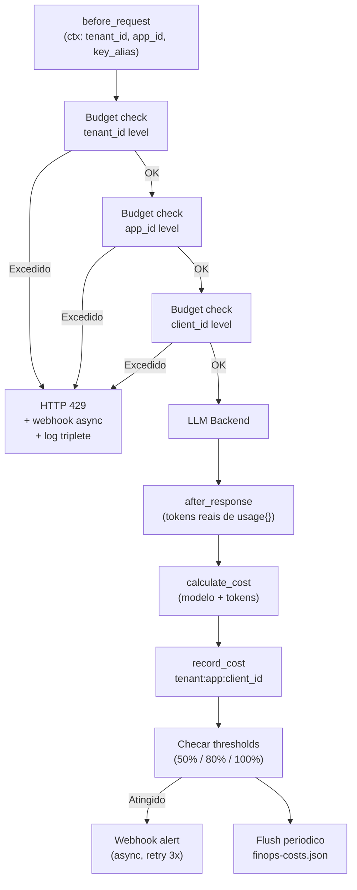

# RF-35 — FinOps (Governanca de Custos Multi-Tenant)

- **RF:** RF-35
- **Titulo:** FinOps — Governanca de Custos Multi-Tenant
- **Autor:** HERMES Team
- **Data:** 2026-03-23
- **Versao:** 1.0
- **Status:** RASCUNHO

## Objetivo

Plugin de governança financeira que agrega e controla custos de uso do LLM na hierarquia `tenant_id → app_id → client_id (key_alias)`, complementando RF-02 (Usage Tracking por key) e RF-20 (Cost Controller por key) com visão consolidada multi-tenant. Permite definir budgets em três níveis com herança de limites, disparar alertas via webhook quando thresholds são atingidos, e exportar dados de custo em CSV para integração com ferramentas de FinOps externas. Registra custos no `after_response` com tokens reais reportados pelo LLM, e bloqueia em `before_request` quando budget está excedido.

## Escopo

- **Inclui:** Agregação de custos na hierarquia tenant→app→client_id; budgets nos três níveis com herança; alertas webhook assíncronos ao atingir thresholds (50%, 80%, 100%); export CSV com filtros por período, tenant, app; pricing table por modelo (reutiliza estrutura de RF-20); persistência em disco com flush periódico; rotação de períodos UTC (diário e mensal); endpoints `/admin/finops/costs`, `/admin/finops/costs/{tenant_id}`, `/admin/finops/budgets`, `/admin/finops/budgets/{tenant_id}`, `/admin/finops/export`; dashboard: stats via plugin card genérico, extensão natural do `/admin/costs` existente
- **Nao inclui:** Billing externo ou integração com sistemas de cobrança; UI de configuração de budgets (fora do escopo); Parquet binário nativo (CSV com schema bem definido é suficiente); integração direta com Datadog/CloudHealth (apenas export de dados); hot-reload de budgets sem restart; substituição de RF-02 ou RF-20 (coexistem e complementam)

## Descricao Funcional Detalhada

### Arquitetura



### Hierarquia de Budget com Heranca

Budgets existem em três níveis independentes. Um request é bloqueado quando **qualquer** nível está excedido — verificação em ordem tenant → app → key:

- **Tenant budget:** limite agregado para todo o tenant
- **App budget:** limite para um app específico dentro do tenant (`"acme:payments-app"`)
- **Key budget:** limite para um client_id específico dentro de app (`"acme:payments-app:sk-prod"`)

Herança soft: se app budget não definido, o gasto do app conta contra o tenant budget. Não há hard-enforcement matemático de que `sum(app_budgets) ≤ tenant_budget` — é responsabilidade do operador configurar de forma consistente.

### Calculo de Custo

```cpp
// after_response: usa tokens reais do campo "usage" da response do LLM
double cost = (prompt_tokens  / 1000.0) * pricing.input_per_1k_tokens
            + (completion_tokens / 1000.0) * pricing.output_per_1k_tokens;
```

Quando `usage` ausente na response (alguns providers), usa estimativa por tamanho do body com log de warning.

### Alertas de Threshold

Alertas são disparados de forma assíncrona (fire-and-forget com retry 3x com backoff 2s/4s/8s). Cada threshold por nível é disparado apenas uma vez por período (rastreado em memória — aceita perda em crash). Webhook recebe payload estruturado com contexto completo de tenant.

## Interface / Contrato

```cpp
struct ModelPricing {                       // Reutiliza estrutura de RF-20
    double input_per_1k_tokens;
    double output_per_1k_tokens;
};

struct FinOpsBudget {
    double monthly_limit_usd = 0;           // 0 = ilimitado
    double daily_limit_usd   = 0;
    double spent_monthly_usd = 0;
    double spent_daily_usd   = 0;
    int64_t month_period_start = 0;         // epoch UTC do inicio do mes atual
    int64_t day_period_start   = 0;         // epoch UTC do inicio do dia atual
    std::vector<double> alert_thresholds = {0.5, 0.8, 1.0};
    std::string alert_webhook_url;
    std::set<std::string> fired_thresholds; // "monthly:0.5", "daily:0.8", etc.
};

struct FinOpsKey {
    std::string tenant_id;
    std::string app_id;
    std::string client_id;                  // key_alias
    std::string composite() const {
        return tenant_id + ":" + app_id + ":" + client_id;
    }
};

struct FinOpsCostRecord {
    FinOpsKey   key;
    std::string model;
    int64_t     timestamp_ms;
    int         prompt_tokens;
    int         completion_tokens;
    double      cost_usd;
    bool        cost_estimated;             // true quando usage ausente na response
};

struct FinOpsAlert {
    FinOpsKey   key;
    std::string budget_level;               // "tenant" | "app" | "client"
    std::string period;                     // "monthly" | "daily"
    double      threshold;                  // 0.5 | 0.8 | 1.0
    double      spent_usd;
    double      limit_usd;
    double      used_percentage;
    int64_t     timestamp_ms;
};

class FinOpsPlugin : public Plugin {
public:
    std::string name()    const override { return "finops"; }
    std::string version() const override { return "1.0.0"; }

    bool init(const Json::Value& config) override;
    PluginResult before_request(Json::Value& body, RequestContext& ctx) override;
    PluginResult after_response(Json::Value& response, RequestContext& ctx) override;

    [[nodiscard]] Json::Value stats() const;

private:
    std::unordered_map<std::string, ModelPricing> pricing_;

    // Budgets por nivel (chaves: tenant_id | "tenant:app" | "tenant:app:client")
    std::unordered_map<std::string, FinOpsBudget> tenant_budgets_;
    std::unordered_map<std::string, FinOpsBudget> app_budgets_;
    std::unordered_map<std::string, FinOpsBudget> key_budgets_;

    // Registros de custo para export (buffer em memoria + flush)
    std::vector<FinOpsCostRecord> cost_log_;
    mutable std::shared_mutex mtx_;

    std::string persist_path_;
    int flush_interval_seconds_ = 60;

    [[nodiscard]] FinOpsKey make_key(const RequestContext& ctx) const;

    [[nodiscard]] bool check_budget_level(
        const std::string& budget_key,
        std::unordered_map<std::string, FinOpsBudget>& budgets,
        const std::string& level,
        const FinOpsKey& key);

    void record_cost(const FinOpsKey& key, const std::string& model,
                      int prompt_tokens, int completion_tokens,
                      double cost_usd, bool estimated);

    void check_and_alert(const FinOpsKey& key);
    void fire_webhook_async(const FinOpsAlert& alert);
    void rotate_periods();
    void flush_to_disk();

    [[nodiscard]] double calculate_cost(const std::string& model,
                                         int prompt_tokens,
                                         int completion_tokens) const;
};
```

## Configuracao

```json
{
  "plugins": {
    "pipeline": [
      {
        "name": "finops",
        "enabled": true,
        "config": {
          "persist_path": "data/finops-costs.json",
          "flush_interval_seconds": 60,
          "pricing": {
            "gpt-4o":            { "input_per_1k": 0.0025, "output_per_1k": 0.01   },
            "gpt-3.5-turbo":     { "input_per_1k": 0.0005, "output_per_1k": 0.0015 },
            "llama3:8b":         { "input_per_1k": 0.0,    "output_per_1k": 0.0    },
            "claude-3.5-sonnet": { "input_per_1k": 0.003,  "output_per_1k": 0.015  }
          },
          "tenant_budgets": {
            "acme": {
              "monthly_limit_usd": 2000,
              "daily_limit_usd": 150,
              "alert_thresholds": [0.5, 0.8, 1.0],
              "alert_webhook_url": "https://hooks.slack.com/services/acme-finops"
            }
          },
          "app_budgets": {
            "acme:payments-app": {
              "monthly_limit_usd": 800,
              "daily_limit_usd": 60
            },
            "acme:hr-chatbot": {
              "monthly_limit_usd": 500,
              "daily_limit_usd": 40
            }
          },
          "key_budgets": {
            "acme:payments-app:sk-prod": {
              "monthly_limit_usd": 400,
              "daily_limit_usd": 30
            }
          }
        }
      }
    ]
  }
}
```

### Variaveis de Ambiente

| Variavel | Descricao | Default |
|----------|-----------|---------|
| `FINOPS_ENABLED` | Habilitar plugin | `false` |
| `FINOPS_PERSIST_PATH` | Caminho do arquivo de persistência | `data/finops-costs.json` |
| `FINOPS_FLUSH_INTERVAL` | Intervalo de flush em segundos | `60` |

## Endpoints

| Metodo | Path | Auth | Descricao |
|--------|------|------|-----------|
| `GET` | `/admin/finops/costs` | ADMIN_KEY | Custos agregados de todos os tenants |
| `GET` | `/admin/finops/costs/{tenant_id}` | ADMIN_KEY | Custos detalhados do tenant com hierarquia |
| `GET` | `/admin/finops/budgets` | ADMIN_KEY | Todos os budgets configurados |
| `PUT` | `/admin/finops/budgets/{tenant_id}` | ADMIN_KEY | Atualizar budget do tenant (requer restart para persistir) |
| `GET` | `/admin/finops/export` | ADMIN_KEY | Export CSV (params: from, to, tenant_id, app_id) |

### Response `/admin/finops/costs/{tenant_id}`

```json
{
  "tenant_id": "acme",
  "period": { "month": "2026-03", "day": "2026-03-23" },
  "budget": {
    "monthly_limit_usd": 2000.00,
    "spent_monthly_usd": 847.32,
    "used_percentage_monthly": 42.37,
    "daily_limit_usd": 150.00,
    "spent_daily_usd": 43.21,
    "used_percentage_daily": 28.81
  },
  "by_app": {
    "payments-app": {
      "spent_monthly_usd": 520.10,
      "spent_daily_usd": 28.40,
      "by_client": {
        "sk-prod":    { "spent_monthly_usd": 480.50, "spent_daily_usd": 26.10 },
        "sk-staging": { "spent_monthly_usd": 39.60,  "spent_daily_usd": 2.30  }
      }
    },
    "hr-chatbot": {
      "spent_monthly_usd": 327.22,
      "spent_daily_usd": 14.81
    }
  },
  "by_model": {
    "gpt-4o":        { "requests": 1820, "cost_usd": 712.40 },
    "gpt-3.5-turbo": { "requests": 4200, "cost_usd": 134.92 }
  }
}
```

### Response `/admin/finops/export?from=1740355200&to=1740441600&tenant_id=acme`

```
Content-Type: text/csv

timestamp,tenant_id,app_id,client_id,model,prompt_tokens,completion_tokens,cost_usd,cost_estimated
1740355230,acme,payments-app,sk-prod,gpt-4o,150,320,0.00438,false
1740355290,acme,hr-chatbot,sk-hr,gpt-3.5-turbo,80,210,0.000355,false
1740355310,acme,payments-app,sk-staging,llama3:8b,200,410,0.0,false
```

### Payload do Webhook de Alerta

```json
{
  "event": "finops_budget_threshold",
  "tenant_id": "acme",
  "app_id": "payments-app",
  "client_id": "sk-prod",
  "budget_level": "app",
  "period": "monthly",
  "threshold": 0.8,
  "spent_usd": 642.50,
  "limit_usd": 800.00,
  "used_percentage": 80.31,
  "timestamp": 1740355200
}
```

## Regras de Negocio

1. `before_request`: verifica budgets na ordem tenant → app → key. Primeiro que estourar retorna HTTP 429 com `{"error":{"type":"budget_exceeded","level":"tenant","tenant_id":"acme"}}` e log com triplete.
2. `after_response`: registra custo com tokens reais do campo `usage.prompt_tokens` e `usage.completion_tokens`. Se `usage` ausente, estima por tamanho do body com flag `cost_estimated=true` e log de warning.
3. Herança: bloqueio ocorre por nível independentemente; budget de nível superior não garante matematicamente que sub-níveis não excedam — responsabilidade do operador.
4. Thresholds de alerta: webhook disparado assincronamente quando `spent/limit >= threshold`. Cada threshold (ex: `"monthly:0.8"`) disparado uma vez por período — rastreado em `fired_thresholds` (aceita perda em crash).
5. Rotação de períodos: UTC. Diário: meia-noite UTC. Mensal: dia 1 UTC. Ao detectar mudança de período, `spent_daily_usd` ou `spent_monthly_usd` é zerado e `fired_thresholds` limpo.
6. Persistência: flush periódico em `persist_path`. Perda de até `flush_interval_seconds` de dados em crash é tolerada.
7. Export CSV: filtrável por `from`/`to` (timestamp Unix), `tenant_id`, `app_id`. Sem paginação nesta versão — limitar período para grandes volumes.
8. Modelos sem pricing configurado: `cost_usd = 0.0` sem bloqueio — apenas sem contabilização de custo USD.
9. Fallback para `tenant_id="default"` quando header `x-tenant` ausente.

## Dependencias e Integracoes

- **Internas:** RF-10 (Plugin System), RF-02 (fonte de tokens por key — complementar, não substitui), RF-20 (estrutura `ModelPricing` reutilizada — complementar, não substitui)
- **Externas:** Webhook HTTP (Slack, PagerDuty, custom) para alertas — conexão assíncrona com retry
- **Contexto:** `ctx.metadata["tenant_id"]` e `ctx.metadata["app_id"]` populados pelo gateway core (adendo RF-10); `ctx.key_alias` como `client_id`
- **Complementa (nao substitui):** RF-02 opera com `key_alias` como única dimensão; RF-20 opera com budget USD por `key_alias`; RF-35 adiciona a dimensão tenant→app e alertas webhook

## Criterios de Aceitacao

- [ ] Budget tenant excedido retorna 429 com log contendo {tenant_id, app_id, client_id, level}
- [ ] Budget app excedido retorna 429 verificando tenant OK antes
- [ ] Budget key excedido retorna 429 verificando tenant e app OK antes
- [ ] `after_response` registra custo real com tokens do campo `usage`
- [ ] Quando `usage` ausente, usa estimativa e seta `cost_estimated=true` com log de warning
- [ ] Thresholds de alerta disparam webhook assíncrono com retry 3x
- [ ] Cada threshold disparado apenas uma vez por período por nível
- [ ] Rotação de períodos UTC (diário e mensal) zera contadores corretamente
- [ ] Custo agregado corretamente na hierarquia tenant→app→client_id
- [ ] Flush periódico salva dados em `persist_path`
- [ ] `GET /admin/finops/costs/{tenant_id}` retorna hierarquia com spent e used_percentage
- [ ] `GET /admin/finops/export` retorna CSV filtrado por from, to, tenant_id
- [ ] Fallback para tenant="default" quando `x-tenant` ausente

## Riscos e Trade-offs

1. **Estimativa vs real:** Se LLM não retornar `usage`, custo estimado por tamanho do body é impreciso. Logar warning para rastreabilidade.
2. **Concorrência em record_cost:** `record_cost` chamado a cada request; `shared_mutex` em write pode ser gargalo em alta carga — considerar shard por tenant_id em versão futura.
3. **Webhook assíncrono:** Falha no webhook (ex: Slack down) não afeta a response. Retry 3x com backoff; após 3 falhas, logar e desistir para não bloquear.
4. **Threshold uma vez por período:** `fired_thresholds` em memória — perdido em crash. Aceito como trade-off de simplicidade; operadores devem reconfigurar alertas após restart.
5. **Budget inheritance não hard-enforced:** `sum(app_budgets)` pode exceder `tenant_budget` por configuração incorreta do operador — documentar claramente.
6. **Export volume:** Sem paginação, exports de períodos longos com muitos tenants podem ser lentos. Recomendar filtros estreitos; paginação em versão futura.
7. **CSV vs Parquet:** Export em CSV por simplicidade e zero dependência. Ferramentas externas (pandas, DuckDB, Spark) convertem para Parquet quando necessário.

## Status de Implementacao

RASCUNHO — Especificação definida. Implementação pendente. Reutiliza `ModelPricing` de RF-20 e padrão de persistência JSON de RF-02. Pré-requisitos: gateway core popular `ctx.metadata` com `tenant_id`/`app_id` (adendo RF-10).

## Checklist de Qualidade

- [ ] Objetivo claro e testavel
- [ ] Escopo dentro/fora definido
- [ ] Regras de negocio sem ambiguidade
- [ ] Criterios de aceitacao verificaveis
- [ ] Excecoes e limites cobertos
